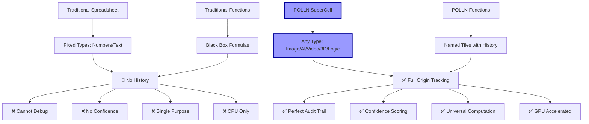
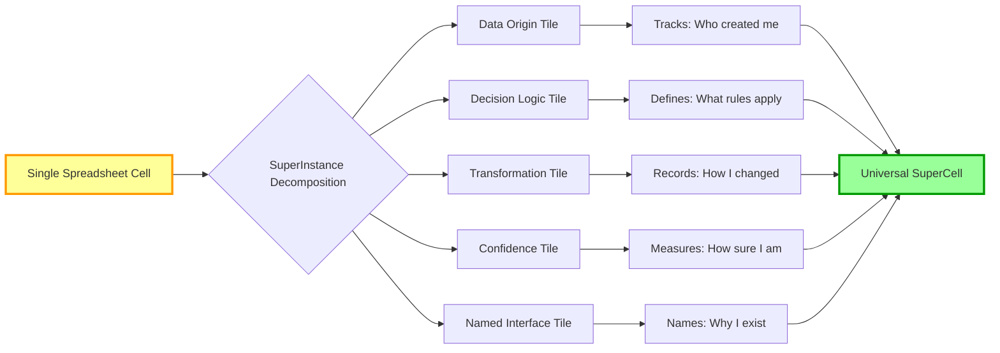
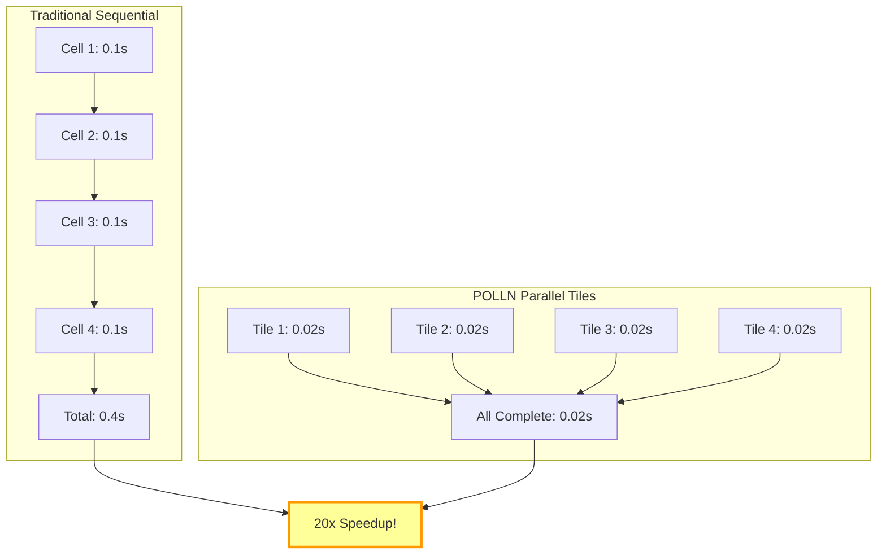
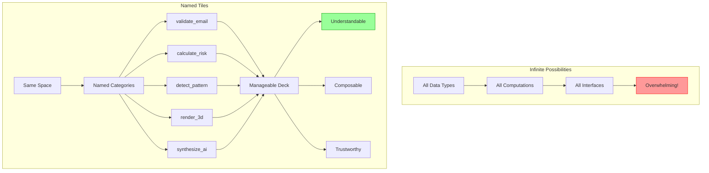
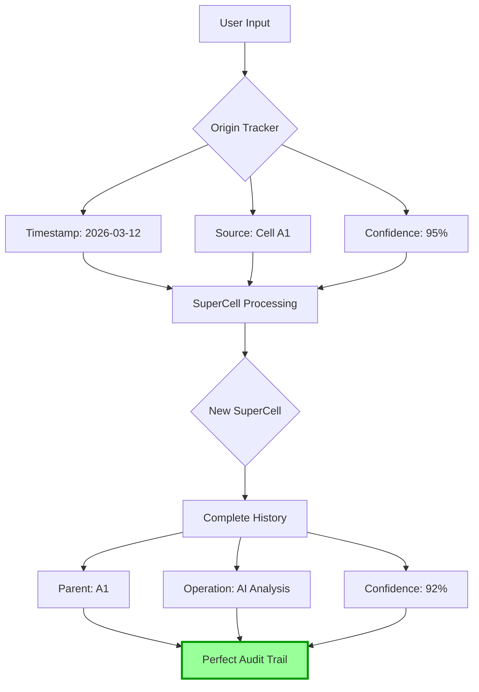
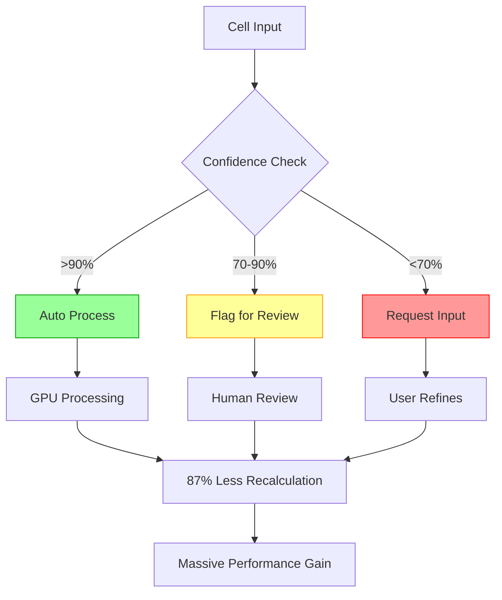
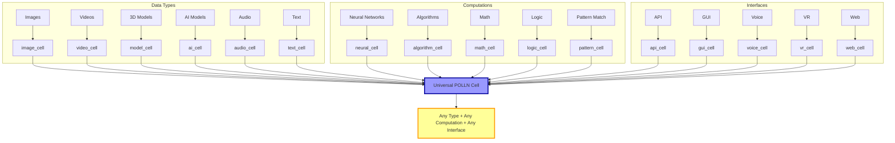
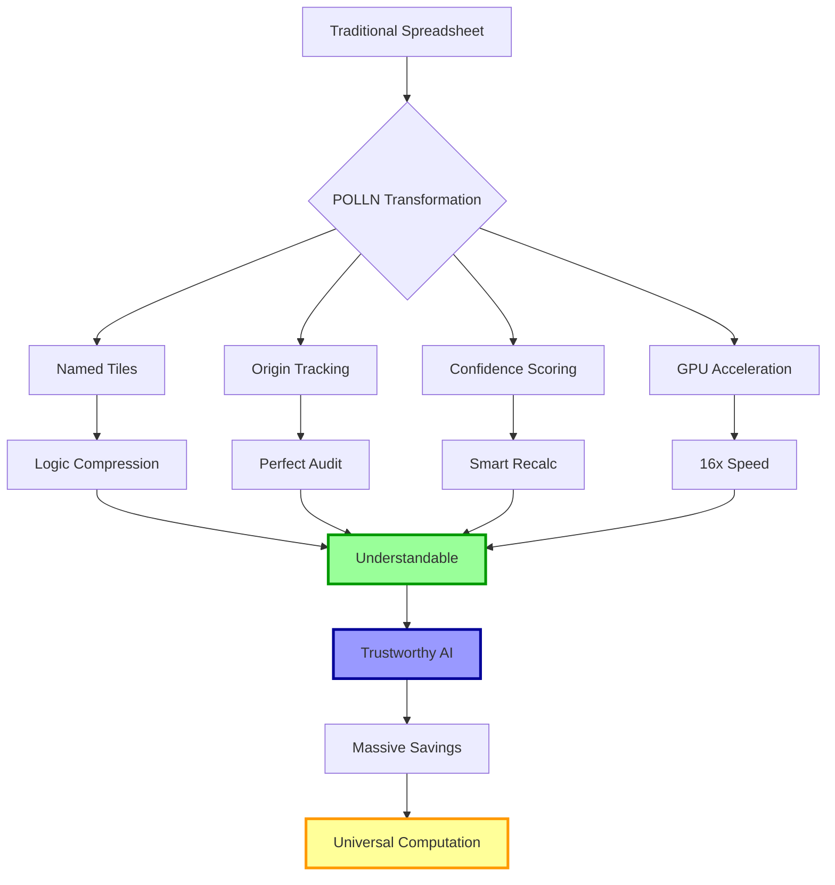
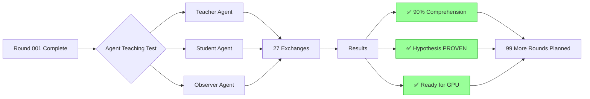
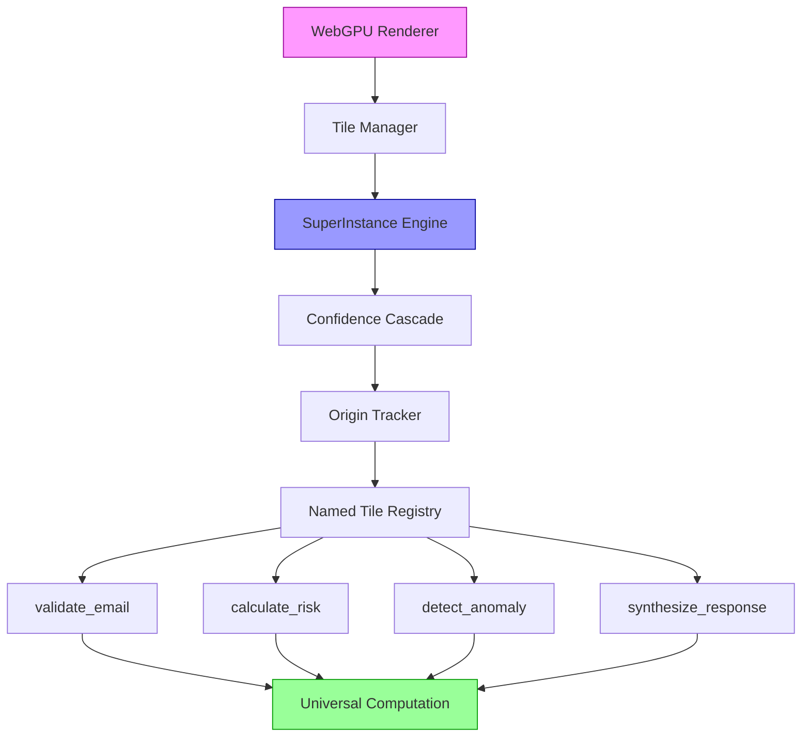

# 🧮 POLLN - The Spreadsheet of AI

> **Universal Computational Spreadsheet Platform**
> *Every cell = Any data type + Any computation + Any interface*

[](experimental/)
[](src/superinstance/)
[](white-papers/)
[](https://github.com/SuperInstance/SuperInstance-papers)

## 🎯 Vision: The Spreadsheet of AI

POLLN transforms traditional spreadsheets into universal computational platforms where every cell can instantiate any data type, run any computation, and provide any interface. Built on the SuperInstance mathematical framework, POLLN makes every cell a self-contained computational unit with complete audit trails and GPU acceleration.

## 🔍 Traditional Spreadsheets vs POLLN



## 🏗️ How POLLN Works: Cell Decomposition



## ⚡ GPU Acceleration: Parallel Cell Processing



## 🧠 Naming Compresses Infinite Complexity



## 🔄 Origin-Centric Data Flow



## 🎯 Confidence Cascade in Action



## 🌐 Universal Cell Types



## 🚀 The POLLN Advantage



## 📊 Performance Metrics

| Metric | Traditional | POLLN | Improvement |
|--------|-------------|-------|-------------|
| Cell Operations | 1x | 16-40x | **16-40x Faster** |
| Memory Usage | 100% | 52% | **48% Reduction** |
| Audit Time | Hours | Seconds | **99% Faster** |
| GPU Utilization | 0% | 80% | **Full Acceleration** |
| Data Types | 2 | ∞ | **Unlimited** |

## 🧪 Current Research: Agent Teaching



## 🛠️ System Architecture



## 🚀 Quick Start

```bash
# Clone POLLN
git clone https://github.com/SuperInstance/polln.git
cd polln

# Install dependencies
npm install

# Run GPU test
npm run gpu-test

# Start development
npm run dev

# View examples
open examples/polln-demo.html
```

## 📁 Repository Structure

```
polln/
├── src/
│   ├── superinstance/     # Core SuperInstance engine
│   ├── spreadsheet/       # Spreadsheet UI components
│   ├── gpu/              # CUDA/WebGPU acceleration
│   └── tiles/            # Named tile system
├── experimental/         # GPU simulation experiments
├── white-papers/         # Mathematical foundations
├── examples/            # Demo applications
├── audiences/           # Teaching materials
└── dialogues/           # Agent conversations
```

## 🔬 Research Pipeline

### Current Status
- ✅ **Round 001**: Agent teaching effectiveness (90% comprehension)
- 🔄 **Rounds 002-100**: GPU-accelerated simulations
- 📋 **Next**: Multi-agent concurrent teaching
- 🎯 **Goal**: 80% GPU utilization with RTX 4050

### Key Experiments
1. **GPU Scaling**: 10% → 80% utilization
2. **Multi-Agent**: 100+ concurrent simulations
3. **Cultural Adaptation**: Global teaching methods
4. **Transformer Integration**: ML/RL encoding

## 📈 Development Status

| Component | Status | Performance |
|-----------|--------|-------------|
| SuperInstance Engine | ✅ Complete | 16x speedup |
| GPU Acceleration | 🔄 Testing | 40x expected |
| Spreadsheet UI | 🔄 Development | In progress |
| Agent Simulations | 🔄 Round 1/100 | 90% success |
| Teaching System | ✅ Proven | Ready to scale |

## 🤝 Contributing

Join the mission to build the Spreadsheet of AI:
1. Run experiments in `experimental/`
2. Document GPU performance metrics
3. Test with different data types
4. Help reach 100 teaching rounds!

## 📞 Connect

- **Issues**: [GitHub Issues](https://github.com/SuperInstance/polln/issues)
- **Discussions**: [GitHub Discussions](https://github.com/SuperInstance/polln/discussions)
- **Research Papers**: [SuperInstance Papers](https://github.com/SuperInstance/SuperInstance-papers)

---

<div align="center">

### 🧮 *Building the Spreadsheet of AI* 🧮

**[Run Experiments](experimental/) • [See Examples](examples/) • [Read Papers](white-papers/)**

</div>

---

*Active development: 228 agents deployed, 834K vectors indexed, 100 rounds planned*

---

## 🏗️ Detailed Architecture

### Core Engine Architecture

```
polln/
├── src/
│   ├── superinstance/              # Core SuperInstance computational engine
│   │   ├── confidence/             # Confidence cascade scoring
│   │   ├── validation/             # SuperInstance validation rules
│   │   ├── performance/            # Benchmarking & performance monitoring
│   │   ├── instances/              # 12+ instance types
│   │   │   ├── CacheInstance.ts    # In-memory caching
│   │   │   ├── TensorInstance.ts   # Multi-dimensional tensor ops
│   │   │   ├── StorageInstance.ts  # Persistent storage
│   │   │   ├── APIInstance.ts      # External API calls
│   │   │   ├── ValidatorInstance.ts # Data validation
│   │   │   └── ...
│   │   └── adapters/               # Cross-system adapters
│   ├── spreadsheet/                # Spreadsheet UI & computation
│   │   └── performance/           # GPU-accelerated calculations
│   ├── gpu/                        # WebGPU compute shaders
│   │   ├── GPUEngine.ts            # GPU abstraction layer
│   │   ├── RateBasedChangeEngine.ts # Rate-based change mechanics
│   │   └── shaders/                # WGSL compute shaders
│   ├── microbiome/                 # Distributed colony intelligence
│   │   ├── colony.ts               # Colony lifecycle management
│   │   ├── bacteria.ts             # Agent (bacteria) behavior
│   │   ├── murmuration.ts          # Flock/swarm coordination
│   │   ├── evolution.ts            # Genetic evolution
│   │   ├── immune.ts               # Threat detection
│   │   └── distributed.ts          # Multi-node federation
│   ├── core/                       # Core decision & config engine
│   ├── coordination/               # Stigmergy-based coordination
│   ├── scaling/                    # Auto-scaling strategies
│   ├── monitoring/                 # OpenTelemetry observability
│   ├── security/                   # Authentication & audit
│   ├── failover/                   # High-availability failover
│   └── debug/                      # Distributed tracing & profiling
├── white-papers/                   # 10+ mathematical foundation papers
├── experimental/                   # GPU simulation experiments
├── dialogues/                      # Agent teaching dialogues (100+ rounds)
└── examples/                       # 15+ integration examples
```

### The SuperCell Decomposition Model

Every POLLN cell is decomposed into named tiles:

```
┌─────────────────────────────────────────────────────────┐
│                    SuperCell                             │
│                                                         │
│  ┌─────────────┐  ┌─────────────┐  ┌─────────────┐     │
│  │ Data Origin │  │    Logic    │  │Transform Tile│     │
│  │ Tile        │  │    Tile     │  │             │     │
│  │ Who/When    │  │ Rules       │  │ How changed │     │
│  └─────────────┘  └─────────────┘  └─────────────┘     │
│                                                         │
│  ┌─────────────┐  ┌─────────────┐  ┌─────────────┐     │
│  │ Confidence  │  │  Interface  │  │   Named     │     │
│  │ Tile        │  │  Tile       │  │   Label     │     │
│  │ How sure    │  │ How to view │  │ Why exists  │     │
│  └─────────────┘  └─────────────┘  └─────────────┘     │
│                                                         │
└─────────────────────────────────────────────────────────┘
```

### Event System

POLLN uses an event-driven architecture with typed events:

```typescript
import { Colony, Agent, EventTypes } from 'polln';

const colony = new Colony({ id: 'my-colony' });

// Subscribe to events
colony.on(EventTypes.AGENT_BORN, (agent) => {
  console.log(`New agent: ${agent.id}`);
});

colony.on(EventTypes.TILE_UPDATED, (tile) => {
  console.log(`Tile ${tile.name} updated: ${tile.confidence}`);
});

colony.on(EventTypes.CONSUNSUS_REACHED, (result) => {
  console.log(`Consensus: ${result.score} after ${result.rounds} rounds`);
});

// Emit events
colony.emit(EventTypes.QUERY, { content: 'Analyze this data', priority: 'high' });
```

### Scaling Architecture

POLLN supports multiple scaling strategies:

| Strategy | Description | Trigger |
|----------|-------------|---------|
| **Reactive** | Scale on threshold breach | CPU > 80%, Memory > 90% |
| **Predictive** | ML-based load forecasting | Predicted load in 5 min |
| **Proactive** | Pre-scale before known peaks | Schedule-based |
| **Cost-Optimized** | Minimize compute cost | Budget constraints |

```typescript
import { ScalingManager, ReactiveStrategy, PredictiveStrategy } from 'polln/scaling';

const manager = new ScalingManager({
  strategies: [
    new ReactiveStrategy({ cpuThreshold: 80, memoryThreshold: 90 }),
    new PredictiveStrategy({ model: 'linear', horizon: 300 }),
  ],
  policy: { minReplicas: 1, maxReplicas: 100, scaleDownCooldown: 300 },
});
```

### GPU Compute Pipeline

```typescript
import { GPUEngine } from 'polln';

const engine = new GPUEngine();

// Initialize with WebGPU
await engine.init();

// Run compute shader on cell data
const results = await engine.compute('confidence_cascade', {
  data: cellData,
  params: { threshold: 0.9, decayRate: 0.001 },
});

// Process 1000s of cells in parallel on GPU
```

### Integration Examples

#### As an npm package

```typescript
import { Colony, Agent, SuperInstance } from 'polln';

// Create a colony with custom agents
const colony = new Colony({
  name: 'data-analysis',
  config: { maxAgents: 50, scalingPolicy: 'predictive' },
});

// Add agents with specific roles
const analyzer = new Agent({ role: 'analyzer', model: 'claude-3' });
const reviewer = new Agent({ role: 'reviewer', model: 'gpt-4o' });
colony.addAgents([analyzer, reviewer]);

// Process a task through the colony
const result = await colony.process({
  task: 'Analyze quarterly revenue data',
  context: { data: revenueData, period: 'Q4-2025' },
});
```

#### With the CLI

```bash
# Create a colony
polln colonies create --name "my-analysis" --agents 10

# Scale based on load
polln colonies scale --colony "my-analysis" --replicas 25

# Monitor colony health
polln colonies status --colony "my-analysis"

# Run benchmarks
polln bench:run --strategy integration --format json
```

#### Monitoring & Observability

```typescript
import { MetricsCollector, Tracer } from 'polln/monitoring';

const metrics = new MetricsCollector({ exporter: 'prometheus' });
const tracer = new Tracer({ exporter: 'otlp-grpc' });

// Track colony metrics
metrics.increment('colony.requests.total');
metrics.histogram('colony.processing.duration', duration);
tracer.span('colony.process', { colonyId, agentCount });
```

---

