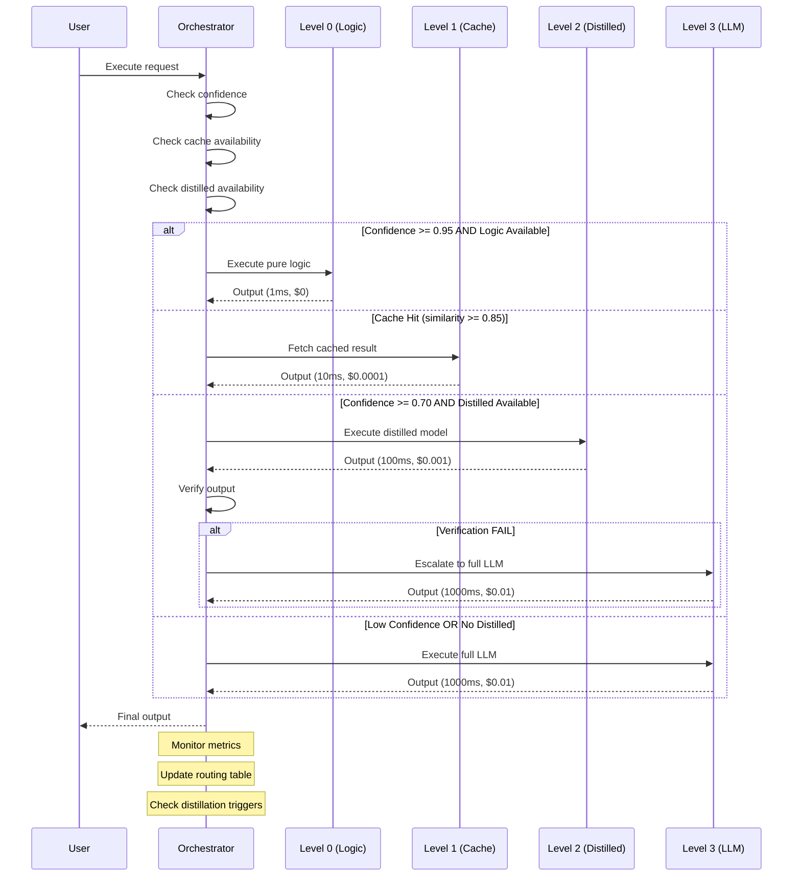

# Large Model Orchestrator Protocol (Breakdown Engine Round 2)

**Author:** R&D Agent - Breakdown Engine Round 2
**Date:** 2026-03-08
**Status:** Phase 6 - Core Innovation Specification
**Version:** 1.0.0

---

## Executive Summary

The Large Model Orchestrator is the supervisory intelligence that manages the hierarchy between full LLMs (Level 3), distilled agents (Level 2), cached patterns (Level 1), and pure logic (Level 0). It orchestrates, verifies, and acts as backup for smaller distilled agents, ensuring reliability while maximizing cost efficiency.

**Core Principle:** The large model is the safety net, not the workhorse. It supervises, verifies, and steps in only when needed.

**Key Innovation:** Confidence-aware orchestration that dynamically routes between logic levels based on reliability, cost, and latency requirements.

---

## Table of Contents

1. [Orchestrator Architecture](#1-orchestrator-architecture)
2. [Orchestrator Responsibilities](#2-orchestrator-responsibilities)
3. [Verification Protocols](#3-verification-protocols)
4. [Distillation Workflows](#4-distillation-workflows)
5. [Fallback Mechanisms](#5-fallback-mechanisms)
6. [Quality Gates](#6-quality-gates)
7. [Message Formats](#7-message-formats)
8. [TypeScript Interfaces](#8-typescript-interfaces)
9. [Integration with ConfidenceScore](#9-integration-with-confidencescore)
10. [Example Workflows](#10-example-workflows)
11. [Implementation Guide](#11-implementation-guide)

---

## 1. Orchestrator Architecture

### 1.1 System Overview

```
┌─────────────────────────────────────────────────────────────┐
│                  Large Model Orchestrator                   │
│                    (Level 3 Supervisor)                     │
│                                                             │
│  ┌──────────────┐  ┌──────────────┐  ┌──────────────┐     │
│  │   Routing    │  │ Verification │  │ Distillation │     │
│  │   Engine     │→│   Engine     │→│   Engine     │     │
│  └──────────────┘  └──────────────┘  └──────────────┘     │
│         │                  │                  │             │
│         └──────────────────┴──────────────────┘             │
│                            │                                │
│                            ▼                                │
│  ┌──────────────────────────────────────────────────────┐ │
│  │              Decision Matrix                          │ │
│  │  ┌────────┬────────┬────────┬────────┬────────┐      │ │
│  │  │Level 0 │Level 1 │Level 2 │Level 3 │ Hybrid │      │ │
│  │  ├────────┼────────┼────────┼────────┼────────┤      │ │
│  │  │ Logic  │ Cache  │Distill│  LLM   │  Both  │      │ │
│  │  └────────┴────────┴────────┴────────┴────────┘      │ │
│  └──────────────────────────────────────────────────────┘ │
└─────────────────────────────────────────────────────────────┘
                            │
          ┌─────────────────┼─────────────────┐
          │                 │                 │
          ▼                 ▼                 ▼
    ┌─────────┐       ┌─────────┐       ┌─────────┐
    │ Level 0 │       │ Level 1 │       │ Level 2 │
    │  Logic  │       │  Cache  │       │Distilled│
    └─────────┘       └─────────┘       └─────────┘
          │                 │                 │
          └─────────────────┴─────────────────┘
                            │
                            ▼
                    ┌─────────────┐
                    │  Fallback   │
                    │   To LLM    │
                    │  (Level 3)  │
                    └─────────────┘
```

### 1.2 Core Components

```typescript
interface LargeModelOrchestrator {
  // Routing
  routeExecution(request: ExecutionRequest): Promise<ExecutionResult>;

  // Verification
  verifyOutput(output: unknown, context: VerificationContext): Promise<VerificationResult>;

  // Distillation
  triggerDistillation(cellId: string): Promise<DistillationResult>;

  // Monitoring
  monitorPerformance(metrics: PerformanceMetrics): void;

  // Learning
  updateRoutingTable(outcomes: OutcomeHistory): void;
}
```

### 1.3 Orchestrator State

```typescript
interface OrchestratorState {
  // Active routing table
  routingTable: Map<string, RoutingDecision>;

  // Verification history
  verificationHistory: VerificationHistory;

  // Distillation queue
  distillationQueue: DistillationTask[];

  // Performance tracking
  performanceMetrics: PerformanceMetrics;

  // Confidence thresholds
  thresholds: QualityThresholds;

  // Fallback statistics
  fallbackStats: FallbackStatistics;
}
```

---

## 2. Orchestrator Responsibilities

### 2.1 Primary Responsibilities

#### 1. Intelligent Routing

The orchestrator decides which logic level handles each request:

```typescript
interface RoutingDecision {
  cellId: string;
  selectedLevel: 0 | 1 | 2 | 3 | 'hybrid';
  reasoning: string[];
  confidence: number;

  // Cost/latency estimates
  estimatedLatencyMs: number;
  estimatedCost: number;

  // Fallback preparation
  fallbackPrepared: boolean;
  fallbackLevel?: 0 | 1 | 2 | 3;
}

async function routeExecution(
  orchestrator: LargeModelOrchestrator,
  request: ExecutionRequest
): Promise<RoutingDecision> {

  // 1. Analyze request characteristics
  const characteristics = await analyzeRequest(request);

  // 2. Get cell confidence scores
  const confidence = orchestrator.getCellConfidence(request.cellId);

  // 3. Check cache availability (Level 1)
  const cacheAvailable = await checkCache(request);

  // 4. Check distilled model availability (Level 2)
  const distilledAvailable = await checkDistilled(request.cellId);

  // 5. Apply routing logic
  return makeRoutingDecision(characteristics, confidence, {
    cacheAvailable,
    distilledAvailable
  });
}
```

#### 2. Output Verification

Every output from Level 0-2 is verified by the orchestrator:

```typescript
interface VerificationResult {
  verified: boolean;
  confidence: number;
  issues: VerificationIssue[];
  corrections?: Correction[];
  escalatedToLevel3: boolean;
}

async function verifyOutput(
  orchestrator: LargeModelOrchestrator,
  output: unknown,
  context: VerificationContext
): Promise<VerificationResult> {

  // 1. Run validation checks
  const validationResults = await orchestrator.runValidations(output, context);

  // 2. Check for common failure modes
  const failureModes = await detectFailureModes(output, context);

  // 3. Verify against constraints
  const constraintCheck = await verifyConstraints(output, context.constraints);

  // 4. If issues found, escalate to Level 3
  if (validationResults.length > 0 || failureModes.length > 0) {
    return {
      verified: false,
      confidence: 0.3,
      issues: [...validationResults, ...failureModes],
      escalatedToLevel3: true
    };
  }

  return {
    verified: true,
    confidence: 0.9,
    issues: [],
    escalatedToLevel3: false
  };
}
```

#### 3. Distillation Trigger

The orchestrator decides when to create Level 2 distilled models:

```typescript
interface DistillationTrigger {
  cellId: string;
  triggerReason: string;
  readinessScore: number;
  trainingDataSize: number;
  estimatedQuality: number;
  costBenefit: CostBenefitAnalysis;
}

async function shouldTriggerDistillation(
  orchestrator: LargeModelOrchestrator,
  cellId: string
): Promise<DistillationTrigger | null> {

  const cell = orchestrator.getCell(cellId);

  // 1. Check usage frequency
  if (cell.executionCount < 100) return null;

  // 2. Check success rate
  if (cell.successRate < 0.9) return null;

  // 3. Check cost (only distill expensive Level 3 cells)
  if (cell.logicLevel !== 3) return null;
  if (cell.avgCostPerCall < 0.005) return null;

  // 4. Check training data availability
  const observations = await cell.getObservations();
  if (observations.length < 100) return null;

  // 5. Calculate cost-benefit
  const costBenefit = await calculateCostBenefit(cell);

  return {
    cellId,
    triggerReason: 'High-usage Level 3 cell with excellent success rate',
    readinessScore: cell.successRate,
    trainingDataSize: observations.length,
    estimatedQuality: await estimateDistilledQuality(observations),
    costBenefit
  };
}
```

#### 4. Fallback Management

The orchestrator manages fallback to higher levels:

```typescript
interface FallbackDecision {
  shouldFallback: boolean;
  targetLevel: 1 | 2 | 3;
  reason: string;
  urgency: 'low' | 'medium' | 'high';
}

async function shouldFallback(
  orchestrator: LargeModelOrchestrator,
  executionResult: ExecutionResult
): Promise<FallbackDecision> {

  // 1. Check for execution errors
  if (executionResult.error) {
    return {
      shouldFallback: true,
      targetLevel: 3,
      reason: `Execution error: ${executionResult.error.message}`,
      urgency: 'high'
    };
  }

  // 2. Check confidence score
  if (executionResult.confidence < orchestrator.thresholds.minConfidence) {
    return {
      shouldFallback: true,
      targetLevel: 3,
      reason: `Confidence too low: ${executionResult.confidence}`,
      urgency: 'medium'
    };
  }

  // 3. Check for verification failures
  if (executionResult.verification && !executionResult.verification.verified) {
    return {
      shouldFallback: true,
      targetLevel: 3,
      reason: 'Verification failed',
      urgency: 'high'
    };
  }

  // 4. Check for pattern degradation
  const degradation = await detectPatternDegradation(executionResult);
  if (degradation.detected) {
    return {
      shouldFallback: true,
      targetLevel: 3,
      reason: `Pattern degradation detected: ${degradation.reason}`,
      urgency: 'medium'
    };
  }

  return {
    shouldFallback: false,
    targetLevel: 3,
    reason: 'No fallback needed',
    urgency: 'low'
  };
}
```

---

## 3. Verification Protocols

### 3.1 Verification Layers

```typescript
enum VerificationLayer {
  // Level 0: Pure Logic verification
  SYNTACTIC = 'syntactic',

  // Level 1: Cache hit verification
  SEMANTIC_SIMILARITY = 'semantic_similarity',

  // Level 2: Distilled model verification
  FUNCTIONAL_CORRECTNESS = 'functional_correctness',

  // Level 3: Full LLM verification (gold standard)
  COMPREHENSIVE = 'comprehensive'
}

interface VerificationProtocol {
  layer: VerificationLayer;
  checks: VerificationCheck[];
  thresholds: VerificationThresholds;
  escalationPath: EscalationPath;
}
```

### 3.2 Verification Checks

```typescript
interface VerificationCheck {
  id: string;
  name: string;
  description: string;

  // Check execution
  execute: (output: unknown, context: VerificationContext) => Promise<CheckResult>;

  // Failure handling
  onFailure: 'warn' | 'retry' | 'escalate';
  severity: 'low' | 'medium' | 'high' | 'critical';

  // Performance
  avgExecutionTimeMs: number;
}

interface CheckResult {
  passed: boolean;
  confidence: number;
  issues: string[];
  suggestions?: string[];
}
```

### 3.3 Level-Specific Verification

#### Level 0: Pure Logic Verification

```typescript
const level0Verification: VerificationProtocol = {
  layer: VerificationLayer.SYNTACTIC,
  checks: [
    {
      id: 'type-check',
      name: 'Type Safety Check',
      description: 'Verify output matches expected type',
      execute: async (output, context) => {
        const expectedType = context.expectedType;
        const actualType = typeof output;

        return {
          passed: actualType === expectedType,
          confidence: actualType === expectedType ? 1.0 : 0.0,
          issues: actualType !== expectedType
            ? [`Type mismatch: expected ${expectedType}, got ${actualType}`]
            : []
        };
      },
      onFailure: 'escalate',
      severity: 'critical',
      avgExecutionTimeMs: 1
    },
    {
      id: 'determinism-check',
      name: 'Determinism Check',
      description: 'Verify pure logic produces consistent output',
      execute: async (output, context) => {
        // For deterministic logic, same input should produce same output
        const historical = await context.getHistoricalOutputs();
        const matches = historical.filter(h => h.output === output).length;

        return {
          passed: matches > 0,
          confidence: matches / historical.length,
          issues: matches === 0
            ? ['Output differs from historical executions']
            : []
        };
      },
      onFailure: 'warn',
      severity: 'low',
      avgExecutionTimeMs: 5
    },
    {
      id: 'range-check',
      name: 'Range Validation',
      description: 'Verify numeric outputs are within expected ranges',
      execute: async (output, context) => {
        if (typeof output !== 'number') {
          return { passed: true, confidence: 1.0, issues: [] };
        }

        const { min, max } = context.expectedRange || { min: -Infinity, max: Infinity };

        return {
          passed: output >= min && output <= max,
          confidence: output >= min && output <= max ? 1.0 : 0.0,
          issues: output < min || output > max
            ? [`Value ${output} outside range [${min}, ${max}]`]
            : []
        };
      },
      onFailure: 'escalate',
      severity: 'high',
      avgExecutionTimeMs: 1
    }
  ],
  thresholds: {
    minConfidence: 0.95,
    maxIssues: 0,
    severityThreshold: 'high'
  },
  escalationPath: {
    nextLevel: 1,
    autoEscalate: true
  }
};
```

#### Level 1: Cache Hit Verification

```typescript
const level1Verification: VerificationProtocol = {
  layer: VerificationLayer.SEMANTIC_SIMILARITY,
  checks: [
    {
      id: 'similarity-check',
      name: 'Cache Similarity Verification',
      description: 'Verify query is sufficiently similar to cached input',
      execute: async (output, context) => {
        const similarity = context.cacheSimilarity;
        const threshold = context.cacheThreshold || 0.85;

        return {
          passed: similarity >= threshold,
          confidence: similarity,
          issues: similarity < threshold
            ? [`Similarity ${similarity} below threshold ${threshold}`]
            : []
        };
      },
      onFailure: 'escalate',
      severity: 'high',
      avgExecutionTimeMs: 2
    },
    {
      id: 'freshness-check',
      name: 'Cache Freshness Check',
      description: 'Verify cached result is not stale',
      execute: async (output, context) => {
        const cacheAge = Date.now() - context.cachedAt;
        const maxAge = context.maxCacheAge || (24 * 60 * 60 * 1000); // 24 hours

        return {
          passed: cacheAge < maxAge,
          confidence: 1 - (cacheAge / maxAge),
          issues: cacheAge >= maxAge
            ? [`Cache age ${Math.round(cacheAge / 1000)}s exceeds limit ${Math.round(maxAge / 1000)}s`]
            : []
        };
      },
      onFailure: 'escalate',
      severity: 'medium',
      avgExecutionTimeMs: 1
    }
  ],
  thresholds: {
    minConfidence: 0.85,
    maxIssues: 1,
    severityThreshold: 'high'
  },
  escalationPath: {
    nextLevel: 2,
    autoEscalate: true
  }
};
```

#### Level 2: Distilled Model Verification

```typescript
const level2Verification: VerificationProtocol = {
  layer: VerificationLayer.FUNCTIONAL_CORRECTNESS,
  checks: [
    {
      id: 'consistency-check',
      name: 'Output Consistency Check',
      description: 'Verify distilled output matches source LLM behavior',
      execute: async (output, context) => {
        // Compare with source LLM on similar inputs
        const sourceOutput = await context.getSourceLLMOutput(context.input);
        const similarity = await computeSimilarity(output, sourceOutput);

        return {
          passed: similarity >= 0.9,
          confidence: similarity,
          issues: similarity < 0.9
            ? [`Output similarity ${similarity} below 0.9 threshold`]
            : []
        };
      },
      onFailure: 'retry',
      severity: 'high',
      avgExecutionTimeMs: 100
    },
    {
      id: 'error-detection',
      name: 'Distillation Error Detection',
      description: 'Detect common distillation artifacts and errors',
      execute: async (output, context) => {
        const issues: string[] = [];

        // Check for truncation
        if (typeof output === 'string' && output.endsWith('...')) {
          issues.push('Possible truncation detected');
        }

        // Check for repetition
        if (await detectRepetition(output)) {
          issues.push('Repetition detected (common distillation artifact)');
        }

        // Check for hallucination
        if (await detectHallucination(output, context.input)) {
          issues.push('Possible hallucination detected');
        }

        return {
          passed: issues.length === 0,
          confidence: 1 - (issues.length * 0.2),
          issues
        };
      },
      onFailure: 'escalate',
      severity: 'medium',
      avgExecutionTimeMs: 50
    },
    {
      id: 'performance-check',
      name: 'Performance Validation',
      description: 'Verify distilled model meets performance targets',
      execute: async (output, context) => {
        const latency = context.executionTimeMs;
        const maxLatency = context.maxLatencyMs || 500;

        return {
          passed: latency <= maxLatency,
          confidence: 1 - (latency / (maxLatency * 2)),
          issues: latency > maxLatency
            ? [`Latency ${latency}ms exceeds target ${maxLatency}ms`]
            : []
        };
      },
      onFailure: 'warn',
      severity: 'low',
      avgExecutionTimeMs: 1
    }
  ],
  thresholds: {
    minConfidence: 0.8,
    maxIssues: 2,
    severityThreshold: 'medium'
  },
  escalationPath: {
    nextLevel: 3,
    autoEscalate: true
  }
};
```

### 3.4 Verification Message Flow

```typescript
interface VerificationMessage {
  id: string;
  type: 'verification_request' | 'verification_response' | 'escalation';

  // Request details
  requestId: string;
  cellId: string;
  logicLevel: 0 | 1 | 2 | 3;

  // Verification details
  protocol: VerificationProtocol;
  output: unknown;
  context: VerificationContext;

  // Results
  result?: VerificationResult;

  // Escalation
  escalationLevel?: 0 | 1 | 2 | 3;
  escalationReason?: string;

  timestamp: number;
}

async function verifyWithOrchestrator(
  orchestrator: LargeModelOrchestrator,
  output: unknown,
  context: VerificationContext
): Promise<VerificationResult> {

  const message: VerificationMessage = {
    id: generateId(),
    type: 'verification_request',
    requestId: context.requestId,
    cellId: context.cellId,
    logicLevel: context.logicLevel,
    protocol: getVerificationProtocol(context.logicLevel),
    output,
    context,
    timestamp: Date.now()
  };

  // Send to orchestrator
  const response = await orchestrator.verify(message);

  return response.result;
}
```

---

## 4. Distillation Workflows

### 4.1 Distillation Trigger Conditions

```typescript
interface DistillationTriggerConditions {
  // Usage-based triggers
  usageCount: {
    minExecutions: number;        // Default: 100
    timeWindow: number;            // Default: 7 days
  };

  // Performance-based triggers
  performance: {
    minSuccessRate: number;        // Default: 0.9
    maxLatencyMs: number;          // Default: 1000ms
    minConfidence: number;         // Default: 0.85
  };

  // Cost-based triggers
  cost: {
    minTotalCost: number;          // Default: $1.00
    minAvgCostPerCall: number;     // Default: $0.005
    costSavingsThreshold: number;  // Default: 0.7 (70% savings)
  };

  // Quality-based triggers
  quality: {
    minConfidenceScore: number;    // Default: 0.8
    minPatternStability: number;   // Default: 0.85
    minOutputConsistency: number;  // Default: 0.9
  };
}

const defaultDistillationTriggers: DistillationTriggerConditions = {
  usageCount: {
    minExecutions: 100,
    timeWindow: 7 * 24 * 60 * 60 * 1000 // 7 days
  },
  performance: {
    minSuccessRate: 0.9,
    maxLatencyMs: 1000,
    minConfidence: 0.85
  },
  cost: {
    minTotalCost: 1.00,
    minAvgCostPerCall: 0.005,
    costSavingsThreshold: 0.7
  },
  quality: {
    minConfidenceScore: 0.8,
    minPatternStability: 0.85,
    minOutputConsistency: 0.9
  }
};
```

### 4.2 Distillation Workflow

```typescript
async function executeDistillationWorkflow(
  orchestrator: LargeModelOrchestrator,
  cellId: string
): Promise<DistillationResult> {

  // Phase 1: Pre-distillation assessment
  const assessment = await assessDistillationReadiness(orchestrator, cellId);

  if (!assessment.ready) {
    return {
      success: false,
      reason: 'Not ready for distillation',
      issues: assessment.issues
    };
  }

  // Phase 2: Training data collection
  const trainingData = await collectTrainingData(cellId, {
    minSamples: 100,
    qualityFilter: 'high-confidence-only',
    diversity: true
  });

  // Phase 3: Distillation execution (by large model)
  const distillationResult = await executeDistillation({
    sourceModel: assessment.sourceModel,
    trainingData,
    targetSize: 500_000_000, // 500M parameters
    task: assessment.task,
    validationSplit: 0.2
  });

  // Phase 4: Quality validation
  const validation = await validateDistilledModel({
    model: distillationResult.model,
    testData: trainingData.validation,
    sourceModel: assessment.sourceModel,
    qualityThreshold: 0.85
  });

  if (!validation.passed) {
    return {
      success: false,
      reason: 'Distillation quality insufficient',
      validation
    };
  }

  // Phase 5: Deployment
  await deployDistilledModel({
    cellId,
    model: distillationResult.model,
    previousLevel: 3,
    newLevel: 2,
    fallback: true // Keep Level 3 as fallback
  });

  // Phase 6: Monitoring
  await enableEnhancedMonitoring(cellId, {
    metrics: ['accuracy', 'latency', 'cost'],
    alertThresholds: {
      accuracy: 0.8,
      latency: 200,
      cost: 0.002
    }
  });

  return {
    success: true,
    modelId: distillationResult.model.id,
    validation,
    deploymentTime: Date.now()
  };
}
```

### 4.3 Distillation Message Formats

```typescript
interface DistillationRequest {
  id: string;
  type: 'distillation_request';

  // Source
  cellId: string;
  sourceModel: string;

  // Training
  trainingData: TrainingData;
  targetSize: number;
  task: string;

  // Configuration
  config: {
    temperature: number;
    maxTokens: number;
    epochs: number;
    batchSize: number;
    learningRate: number;
  };

  timestamp: number;
}

interface DistillationResponse {
  id: string;
  type: 'distillation_response';
  requestId: string;

  // Result
  success: boolean;
  model?: DistilledModel;
  error?: string;

  // Quality metrics
  validation?: ValidationResult;

  // Deployment info
  deploymentInfo?: {
    cellId: string;
    oldLevel: 0 | 1 | 2 | 3;
    newLevel: 0 | 1 | 2 | 3;
    deployedAt: number;
  };

  timestamp: number;
}

interface DistilledModel {
  id: string;
  parameters: number;

  // Performance
  avgLatencyMs: number;
  avgCostPer1kTokens: number;

  // Quality
  qualityScore: number;
  accuracyVsSource: number;

  // Metadata
  distillationDate: number;
  sourceModel: string;
  trainingSamples: number;
}
```

---

## 5. Fallback Mechanisms

### 5.1 Fallback Decision Tree

```
┌─────────────────────────────────────────────────────────┐
│                    Start Execution                      │
└─────────────────────────────────────────────────────────┘
                          │
                          ▼
              ┌───────────────────────┐
              │ Is logicLevel = 0?    │
              └───────────────────────┘
                    │ Yes        │ No
                    ▼            ▼
          ┌─────────────┐  ┌───────────────────────────┐
          │ Execute     │  │ Check cache availability  │
          │ Pure Logic  │  │ (Level 1)                 │
          └─────────────┘  └───────────────────────────┘
                                │
                ┌───────────────┼───────────────┐
                │ Cache Hit     │ Cache Miss     │
                │ (similarity   │ (similarity    │
                │  >= 0.85)     │   < 0.85)      │
                ▼               ▼
        ┌───────────────┐ ┌───────────────────────┐
        │ Return Cache  │ │ Check distilled model │
        │ (Level 1)     │ │ availability (L2)     │
        └───────────────┘ └───────────────────────┘
                                   │
                       ┌───────────┼───────────┐
                       │ Available │ Not Available│
                       │ & Conf >= │ or Conf <   │
                       │ 0.8       │ 0.8         │
                       ▼           ▼
              ┌──────────────┐ ┌──────────────────┐
              │ Execute      │ │ Use Full LLM     │
              │ Distilled    │ │ (Level 3)        │
              │ (Level 2)    │ └──────────────────┘
              └──────────────┘
                       │
                       ▼
          ┌────────────────────────┐
          │ Verify Output          │
          │ (If not Level 3)       │
          └────────────────────────┘
                  │
      ┌───────────┼───────────┐
      │ Pass       │ Fail      │
      ▼           ▼
  ┌────────┐ ┌─────────────┐
  │ Return │ │ Escalate to │
  │ Output │ │ Level 3     │
  └────────┘ └─────────────┘
```

### 5.2 Fallback Protocols

```typescript
interface FallbackProtocol {
  // Triggers
  triggers: FallbackTrigger[];

  // Target level
  targetLevel: 1 | 2 | 3;

  // Escalation strategy
  strategy: 'immediate' | 'retry_once' | 'retry_thrice' | 'gradual';

  // Context preservation
  preserveContext: boolean;

  // Notification
  notifyUser: boolean;
  logEvent: boolean;
}

interface FallbackTrigger {
  type: 'error' | 'timeout' | 'low_confidence' | 'verification_failure' | 'pattern_degradation';
  threshold?: number;
  severity: 'low' | 'medium' | 'high' | 'critical';
}

// Level 0 → Level 1 Fallback
const level0Fallback: FallbackProtocol = {
  triggers: [
    { type: 'error', severity: 'critical' },
    { type: 'verification_failure', severity: 'high' }
  ],
  targetLevel: 1,
  strategy: 'immediate',
  preserveContext: true,
  notifyUser: false,
  logEvent: true
};

// Level 1 → Level 2 Fallback
const level1Fallback: FallbackProtocol = {
  triggers: [
    { type: 'timeout', threshold: 100, severity: 'high' },
    { type: 'low_confidence', threshold: 0.7, severity: 'medium' },
    { type: 'verification_failure', severity: 'high' }
  ],
  targetLevel: 2,
  strategy: 'retry_once',
  preserveContext: true,
  notifyUser: false,
  logEvent: true
};

// Level 2 → Level 3 Fallback
const level2Fallback: FallbackProtocol = {
  triggers: [
    { type: 'error', severity: 'critical' },
    { type: 'timeout', threshold: 500, severity: 'high' },
    { type: 'low_confidence', threshold: 0.6, severity: 'high' },
    { type: 'verification_failure', severity: 'critical' },
    { type: 'pattern_degradation', severity: 'medium' }
  ],
  targetLevel: 3,
  strategy: 'immediate',
  preserveContext: true,
  notifyUser: true,
  logEvent: true
};
```

### 5.3 Fallback Execution

```typescript
async function executeFallback(
  orchestrator: LargeModelOrchestrator,
  currentLevel: 0 | 1 | 2,
  failureReason: string,
  context: ExecutionContext
): Promise<ExecutionResult> {

  const protocol = orchestrator.getFallbackProtocol(currentLevel);

  // Log fallback event
  orchestrator.logEvent({
    type: 'fallback',
    fromLevel: currentLevel,
    toLevel: protocol.targetLevel,
    reason: failureReason,
    context
  });

  // Notify user if configured
  if (protocol.notifyUser) {
    orchestrator.notifyUser({
      message: `Escalating from Level ${currentLevel} to Level ${protocol.targetLevel}`,
      reason: failureReason,
      severity: 'warning'
    });
  }

  // Execute at target level
  const result = await orchestrator.executeAtLevel({
    level: protocol.targetLevel,
    input: context.input,
    cellId: context.cellId,
    preserveContext: protocol.preserveContext
  });

  // Update fallback statistics
  orchestrator.updateFallbackStats({
    fromLevel: currentLevel,
    toLevel: protocol.targetLevel,
    reason: failureReason,
    success: result.success
  });

  return result;
}
```

---

## 6. Quality Gates

### 6.1 Quality Gate Definitions

```typescript
interface QualityGate {
  id: string;
  name: string;
  description: string;

  // Conditions
  conditions: QualityCondition[];

  // Action
  action: 'allow' | 'deny' | 'escalate' | 'monitor';

  // Thresholds
  thresholds: {
    confidence: number;
    successRate: number;
    latency: number;
    cost: number;
  };

  // Monitoring
  monitoringLevel: 'minimal' | 'standard' | 'intensive';
}

interface QualityCondition {
  dimension: 'confidence' | 'success_rate' | 'latency' | 'cost' | 'pattern_stability';
  operator: '>' | '>=' | '<' | '<=' | '==' | '!=';
  threshold: number;
  weight?: number;
}
```

### 6.2 Pre-Execution Quality Gates

```typescript
const preExecutionGates: QualityGate[] = [
  {
    id: 'cell-health-check',
    name: 'Cell Health Check',
    description: 'Verify cell is healthy before execution',
    conditions: [
      { dimension: 'success_rate', operator: '>=', threshold: 0.7 },
      { dimension: 'confidence', operator: '>=', threshold: 0.5 }
    ],
    action: 'deny',
    thresholds: {
      confidence: 0.5,
      successRate: 0.7,
      latency: 5000,
      cost: 1.0
    },
    monitoringLevel: 'standard'
  },
  {
    id: 'pattern-freshness-check',
    name: 'Pattern Freshness Check',
    description: 'Verify pattern is not stale',
    conditions: [
      {
        dimension: 'pattern_stability',
        operator: '>=',
        threshold: 0.6,
        weight: 1.0
      }
    ],
    action: 'escalate',
    thresholds: {
      confidence: 0.6,
      successRate: 0.7,
      latency: 1000,
      cost: 0.5
    },
    monitoringLevel: 'intensive'
  }
];
```

### 6.3 Post-Execution Quality Gates

```typescript
const postExecutionGates: QualityGate[] = [
  {
    id: 'output-quality-check',
    name: 'Output Quality Check',
    description: 'Verify output meets quality standards',
    conditions: [
      { dimension: 'confidence', operator: '>=', threshold: 0.7 },
      { dimension: 'latency', operator: '<=', threshold: 1000 }
    ],
    action: 'escalate',
    thresholds: {
      confidence: 0.7,
      successRate: 0.8,
      latency: 1000,
      cost: 0.1
    },
    monitoringLevel: 'standard'
  },
  {
    id: 'cost-optimization-check',
    name: 'Cost Optimization Check',
    description: 'Check if execution was cost-effective',
    conditions: [
      { dimension: 'cost', operator: '<=', threshold: 0.05 }
    ],
    action: 'monitor',
    thresholds: {
      confidence: 0.8,
      successRate: 0.9,
      latency: 500,
      cost: 0.05
    },
    monitoringLevel: 'minimal'
  }
];
```

### 6.4 Quality Gate Evaluation

```typescript
async function evaluateQualityGates(
  orchestrator: LargeModelOrchestrator,
  gates: QualityGate[],
  context: EvaluationContext
): Promise<QualityGateResult> {

  const results: QualityGateResult[] = [];

  for (const gate of gates) {
    const conditionResults = await Promise.all(
      gate.conditions.map(async condition => {
        const value = await getMetricValue(condition.dimension, context);
        const passed = evaluateCondition(value, condition);

        return {
          dimension: condition.dimension,
          value,
          threshold: condition.threshold,
          passed,
          weight: condition.weight || 1.0
        };
      })
    );

    const allPassed = conditionResults.every(r => r.passed);
    const weightedScore = conditionResults.reduce((sum, r) =>
      sum + (r.passed ? r.weight : 0), 0
    ) / conditionResults.reduce((sum, r) => sum + r.weight, 0);

    results.push({
      gateId: gate.id,
      passed: allPassed,
      score: weightedScore,
      action: allPassed ? gate.action : 'deny',
      monitoringLevel: gate.monitoringLevel,
      conditionResults
    });
  }

  const overallPassed = results.every(r => r.passed);

  return {
    overallPassed,
    results,
    recommendedAction: overallPassed ? 'allow' : results.find(r => !r.passed)?.action || 'deny'
  };
}
```

---

## 7. Message Formats

### 7.1 Orchestrator Message Types

```typescript
enum OrchestratorMessageType {
  // Routing
  ROUTING_REQUEST = 'routing_request',
  ROUTING_RESPONSE = 'routing_response',

  // Verification
  VERIFICATION_REQUEST = 'verification_request',
  VERIFICATION_RESPONSE = 'verification_response',

  // Distillation
  DISTILLATION_TRIGGER = 'distillation_trigger',
  DISTILLATION_STATUS = 'distillation_status',
  DISTILLATION_COMPLETE = 'distillation_complete',

  // Fallback
  FALLBACK_TRIGGER = 'fallback_trigger',
  FALLBACK_EXECUTE = 'fallback_execute',
  FALLBACK_COMPLETE = 'fallback_complete',

  // Monitoring
  METRICS_UPDATE = 'metrics_update',
  PERFORMANCE_ALERT = 'performance_alert',

  // Control
  PAUSE_ORCHESTRATION = 'pause_orchestration',
  RESUME_ORCHESTRATION = 'resume_orchestration',
  UPDATE_THRESHOLDS = 'update_thresholds'
}
```

### 7.2 Message Schemas

```typescript
interface OrchestratorMessage {
  id: string;
  type: OrchestratorMessageType;
  timestamp: number;

  // Routing
  routing?: {
    requestId: string;
    cellId: string;
    input: unknown;
    decision: RoutingDecision;
  };

  // Verification
  verification?: {
    requestId: string;
    cellId: string;
    output: unknown;
    result: VerificationResult;
  };

  // Distillation
  distillation?: {
    cellId: string;
    status: 'pending' | 'in_progress' | 'complete' | 'failed';
    progress?: number;
    result?: DistillationResult;
  };

  // Fallback
  fallback?: {
    fromLevel: 0 | 1 | 2;
    toLevel: 1 | 2 | 3;
    reason: string;
    result?: ExecutionResult;
  };

  // Monitoring
  metrics?: {
    cellId: string;
    metrics: PerformanceMetrics;
    alert?: PerformanceAlert;
  };

  // Control
  control?: {
    action: 'pause' | 'resume' | 'update';
    config?: Partial<OrchestratorConfig>;
  };
}
```

### 7.3 Message Flow Examples

#### Routing Request Flow

```typescript
// 1. Client sends routing request
const routingRequest: OrchestratorMessage = {
  id: generateId(),
  type: OrchestratorMessageType.ROUTING_REQUEST,
  timestamp: Date.now(),
  routing: {
    requestId: 'req-123',
    cellId: 'cell-456',
    input: { text: 'Summarize this document' },
    decision: null // To be filled by orchestrator
  }
};

// 2. Orchestrator processes and responds
const routingResponse: OrchestratorMessage = {
  id: generateId(),
  type: OrchestratorMessageType.ROUTING_RESPONSE,
  timestamp: Date.now(),
  routing: {
    requestId: 'req-123',
    cellId: 'cell-456',
    input: { text: 'Summarize this document' },
    decision: {
      cellId: 'cell-456',
      selectedLevel: 2,
      reasoning: [
        'Distilled model available',
        'High confidence (0.92)',
        'Cost-effective for this task'
      ],
      confidence: 0.92,
      estimatedLatencyMs: 150,
      estimatedCost: 0.002,
      fallbackPrepared: true,
      fallbackLevel: 3
    }
  }
};
```

#### Verification Flow

```typescript
// 1. Level 2 execution completes, send for verification
const verificationRequest: OrchestratorMessage = {
  id: generateId(),
  type: OrchestratorMessageType.VERIFICATION_REQUEST,
  timestamp: Date.now(),
  verification: {
    requestId: 'req-123',
    cellId: 'cell-456',
    output: 'Summary of the document...',
    result: null // To be filled by orchestrator
  }
};

// 2. Orchestrator verifies and responds
const verificationResponse: OrchestratorMessage = {
  id: generateId(),
  type: OrchestratorMessageType.VERIFICATION_RESPONSE,
  timestamp: Date.now(),
  verification: {
    requestId: 'req-123',
    cellId: 'cell-456',
    output: 'Summary of the document...',
    result: {
      verified: true,
      confidence: 0.89,
      issues: [],
      escalatedToLevel3: false
    }
  }
};
```

---

## 8. TypeScript Interfaces

### 8.1 Core Interfaces

```typescript
/**
 * Large Model Orchestrator
 *
 * Manages the hierarchy between logic levels and ensures reliability
 */
export interface LargeModelOrchestrator {
  // Identity
  id: string;
  version: string;

  // Configuration
  config: OrchestratorConfig;

  // State
  state: OrchestratorState;

  // Routing
  route(request: ExecutionRequest): Promise<RoutingDecision>;

  // Verification
  verify(output: unknown, context: VerificationContext): Promise<VerificationResult>;

  // Distillation
  triggerDistillation(cellId: string): Promise<DistillationResult>;

  // Fallback
  executeFallback(fromLevel: 0 | 1 | 2, reason: string, context: ExecutionContext): Promise<ExecutionResult>;

  // Monitoring
  monitor(cellId: string, metrics: PerformanceMetrics): void;

  // Control
  pause(): void;
  resume(): void;
  updateConfig(config: Partial<OrchestratorConfig>): void;
}

export interface OrchestratorConfig {
  // Routing
  routing: {
    defaultLevel: 0 | 1 | 2 | 3;
    preferCache: boolean;
    preferDistilled: boolean;
  };

  // Thresholds
  thresholds: QualityThresholds;

  // Verification
  verification: {
    enabled: boolean;
    level: VerificationLevel;
    autoEscalate: boolean;
  };

  // Distillation
  distillation: {
    enabled: boolean;
    autoTrigger: boolean;
    triggers: DistillationTriggerConditions;
  };

  // Fallback
  fallback: {
    enabled: boolean;
    protocols: Record<0 | 1 | 2, FallbackProtocol>;
  };

  // Monitoring
  monitoring: {
    enabled: boolean;
    metrics: string[];
    alertThresholds: AlertThresholds;
  };
}

export interface QualityThresholds {
  // Confidence thresholds
  confidence: {
    min: number;           // Minimum confidence to execute
    verification: number;  // Minimum confidence to skip verification
    excellent: number;     // Threshold for excellent performance
  };

  // Performance thresholds
  performance: {
    maxLatencyMs: number;
    maxCost: number;
    minSuccessRate: number;
  };

  // Quality thresholds
  quality: {
    minPatternStability: number;
    minOutputConsistency: number;
    minEdgeCaseHandling: number;
  };
}

export interface VerificationContext {
  requestId: string;
  cellId: string;
  logicLevel: 0 | 1 | 2 | 3;
  input: unknown;
  output: unknown;

  // Constraints
  constraints?: {
    expectedType?: string;
    expectedRange?: { min: number; max: number };
    maxLength?: number;
    allowedValues?: unknown[];
  };

  // Metadata
  metadata?: {
    executionTimeMs: number;
    cacheSimilarity?: number;
    cachedAt?: number;
    maxCacheAge?: number;
  };

  // Historical data
  getHistoricalOutputs?: () => Promise<HistoricalOutput[]>;
  getSourceLLMOutput?: (input: unknown) => Promise<unknown>;
}

export interface VerificationResult {
  verified: boolean;
  confidence: number;
  issues: VerificationIssue[];
  corrections?: Correction[];
  escalatedToLevel3: boolean;
  escalatedReason?: string;
}

export interface VerificationIssue {
  type: 'type_mismatch' | 'range_error' | 'low_similarity' | 'staleness' | 'truncation' | 'repetition' | 'hallucination';
  severity: 'low' | 'medium' | 'high' | 'critical';
  message: string;
  suggestion?: string;
}

export interface Correction {
  type: 'retry' | 'escalate' | 'adjust';
  description: string;
  params?: Record<string, unknown>;
}

export interface DistillationResult {
  success: boolean;
  modelId?: string;
  validation?: ValidationResult;
  deploymentInfo?: DeploymentInfo;
  error?: string;
  issues?: string[];
}

export interface ValidationResult {
  passed: boolean;
  score: number;
  accuracyVsSource: number;
  latency: number;
  cost: number;
  issues: string[];
}

export interface DeploymentInfo {
  cellId: string;
  oldLevel: 0 | 1 | 2 | 3;
  newLevel: 0 | 1 | 2 | 3;
  deployedAt: number;
  fallbackEnabled: boolean;
}

export interface ExecutionRequest {
  id: string;
  cellId: string;
  input: unknown;
  context?: Record<string, unknown>;
}

export interface ExecutionResult {
  success: boolean;
  output?: unknown;
  error?: Error;
  confidence: number;
  logicLevel: 0 | 1 | 2 | 3;
  executionTimeMs: number;
  cost: number;
  verification?: VerificationResult;
  fallbackTriggered: boolean;
}

export interface ExecutionContext {
  requestId: string;
  cellId: string;
  input: unknown;
  logicLevel: 0 | 1 | 2 | 3;
  preserveContext: boolean;
}

export interface PerformanceMetrics {
  cellId: string;
  timestamp: number;

  // Execution metrics
  executionCount: number;
  successCount: number;
  failureCount: number;

  // Performance
  avgLatencyMs: number;
  p95LatencyMs: number;
  p99LatencyMs: number;
  avgCost: number;

  // Quality
  avgConfidence: number;
  successRate: number;

  // Verification
  verificationPassRate: number;
  fallbackRate: number;
}

export interface PerformanceAlert {
  type: 'low_confidence' | 'high_latency' | 'high_cost' | 'high_failure_rate' | 'pattern_degradation';
  severity: 'info' | 'warning' | 'error' | 'critical';
  message: string;
  metrics: PerformanceMetrics;
  recommendation?: string;
}

export interface AlertThresholds {
  confidence: {
    warning: number;
    error: number;
  };
  latency: {
    warning: number;  // ms
    error: number;    // ms
  };
  cost: {
    warning: number;  // $
    error: number;    // $
  };
  failureRate: {
    warning: number;  // %
    error: number;    // %
  };
}

export interface HistoricalOutput {
  input: unknown;
  output: unknown;
  timestamp: number;
  confidence: number;
}
```

### 8.2 Configuration Interfaces

```typescript
export interface OrchestratorState {
  // Active routing table
  routingTable: Map<string, RoutingDecision>;

  // Verification history
  verificationHistory: VerificationHistory;

  // Distillation queue
  distillationQueue: DistillationTask[];

  // Performance tracking
  performanceMetrics: Map<string, PerformanceMetrics>;

  // Active fallbacks
  activeFallbacks: Map<string, FallbackState>;

  // Last updated
  lastUpdated: number;
}

export interface VerificationHistory {
  cellId: string;
  verifications: VerificationRecord[];
  stats: {
    total: number;
    passed: number;
    failed: number;
    passRate: number;
  };
}

export interface VerificationRecord {
  timestamp: number;
  logicLevel: 0 | 1 | 2 | 3;
  verified: boolean;
  confidence: number;
  issues: string[];
  escalated: boolean;
}

export interface DistillationTask {
  id: string;
  cellId: string;
  status: 'pending' | 'in_progress' | 'complete' | 'failed';
  priority: number;
  createdAt: number;
  startedAt?: number;
  completedAt?: number;
  result?: DistillationResult;
}

export interface FallbackState {
  fromLevel: 0 | 1 | 2;
  toLevel: 1 | 2 | 3;
  reason: string;
  triggeredAt: number;
  completed: boolean;
  result?: ExecutionResult;
}
```

---

## 9. Integration with ConfidenceScore

### 9.1 Confidence-Based Routing

```typescript
/**
 * Use ConfidenceScore to make routing decisions
 */
async function routeByConfidence(
  orchestrator: LargeModelOrchestrator,
  cellId: string,
  confidence: ConfidenceScore
): Promise<RoutingDecision> {

  const { overall, dimensions } = confidence;

  // High confidence (>0.95): Use induced logic
  if (overall >= 0.95) {
    return {
      cellId,
      selectedLevel: 0, // Pure logic if available
      reasoning: [
        `Excellent confidence (${overall.toFixed(2)})`,
        `Pattern stability: ${dimensions.patternStability.toFixed(2)}`,
        `Output consistency: ${dimensions.outputConsistency.toFixed(2)}`
      ],
      confidence: overall,
      estimatedLatencyMs: 1,
      estimatedCost: 0,
      fallbackPrepared: false
    };
  }

  // Good confidence (0.85-0.95): Use cache or distilled
  if (overall >= 0.85) {
    // Check if cache is available
    const cacheAvailable = await orchestrator.checkCache(cellId);

    return {
      cellId,
      selectedLevel: cacheAvailable ? 1 : 2,
      reasoning: [
        `High confidence (${overall.toFixed(2)})`,
        cacheAvailable ? 'Cache hit available' : 'Distilled model available',
        `Historical success: ${dimensions.historicalSuccess.toFixed(2)}`
      ],
      confidence: overall,
      estimatedLatencyMs: cacheAvailable ? 10 : 100,
      estimatedCost: cacheAvailable ? 0.0001 : 0.001,
      fallbackPrepared: true,
      fallbackLevel: 3
    };
  }

  // Moderate confidence (0.70-0.85): Use distilled with verification
  if (overall >= 0.70) {
    return {
      cellId,
      selectedLevel: 2,
      reasoning: [
        `Moderate confidence (${overall.toFixed(2)})`,
        'Using distilled model with verification',
        `Simulation coverage: ${dimensions.simulationCoverage.toFixed(2)}`
      ],
      confidence: overall,
      estimatedLatencyMs: 100,
      estimatedCost: 0.001,
      fallbackPrepared: true,
      fallbackLevel: 3
    };
  }

  // Low confidence (<0.70): Use full LLM
  return {
    cellId,
    selectedLevel: 3,
    reasoning: [
      `Low confidence (${overall.toFixed(2)})`,
      'Escalating to full LLM',
      `Low simulation coverage: ${dimensions.simulationCoverage.toFixed(2)}`
    ],
    confidence: overall,
    estimatedLatencyMs: 1000,
    estimatedCost: 0.01,
    fallbackPrepared: false
  };
}
```

### 9.2 Confidence-Based Verification

```typescript
/**
 * Use ConfidenceScore dimensions to verify outputs
 */
async function verifyByConfidence(
  output: unknown,
  context: VerificationContext,
  confidence: ConfidenceScore
): Promise<VerificationResult> {

  const { overall, dimensions, uncertainty } = confidence;

  // Check if confidence is high enough to skip verification
  if (overall >= 0.95 && dimensions.edgeCaseHandling >= 0.9) {
    return {
      verified: true,
      confidence: overall,
      issues: [],
      escalatedToLevel3: false
    };
  }

  const issues: VerificationIssue[] = [];

  // Check pattern stability
  if (dimensions.patternStability < 0.7) {
    issues.push({
      type: 'repetition',
      severity: 'medium',
      message: `Low pattern stability (${dimensions.patternStability.toFixed(2)})`,
      suggestion: 'Consider using full LLM for more consistent results'
    });
  }

  // Check output consistency
  if (dimensions.outputConsistency < 0.7) {
    issues.push({
      type: 'hallucination',
      severity: 'high',
      message: `Low output consistency (${dimensions.outputConsistency.toFixed(2)})`,
      suggestion: 'Output may not be reliable, consider escalation'
    });
  }

  // Check edge case handling
  if (dimensions.edgeCaseHandling < 0.5) {
    issues.push({
      type: 'range_error',
      severity: 'high',
      message: `Poor edge case handling (${dimensions.edgeCaseHandling.toFixed(2)})`,
      suggestion: 'Input may be an edge case, escalation recommended'
    });
  }

  // Check simulation coverage
  if (dimensions.simulationCoverage < 0.5) {
    issues.push({
      type: 'low_similarity',
      severity: 'medium',
      message: `Low simulation coverage (${dimensions.simulationCoverage.toFixed(2)})`,
      suggestion: 'Input may be outside training distribution'
    });
  }

  // Determine if verification passed
  const criticalIssues = issues.filter(i => i.severity === 'critical' || i.severity === 'high');
  const passed = criticalIssues.length === 0;

  return {
    verified: passed,
    confidence: overall,
    issues,
    escalatedToLevel3: !passed,
    escalatedReason: !passed ? 'Critical or high-severity issues detected' : undefined
  };
}
```

### 9.3 Confidence-Based Distillation Trigger

```typescript
/**
 * Use ConfidenceScore to decide when to distill
 */
async function shouldDistillByConfidence(
  cellId: string,
  confidence: ConfidenceScore,
  usage: UsageStats
): Promise<DistillationTrigger | null> {

  const { overall, dimensions } = confidence;

  // Must have high overall confidence
  if (overall < 0.9) return null;

  // Must have sufficient usage
  if (usage.executionCount < 100) return null;

  // Must have high success rate
  if (dimensions.historicalSuccess < 0.95) return null;

  // Must have high pattern stability
  if (dimensions.patternStability < 0.9) return null;

  // Must have high output consistency
  if (dimensions.outputConsistency < 0.9) return null;

  // All checks passed - ready for distillation
  return {
    cellId,
    triggerReason: 'High confidence and usage - ready for distillation',
    readinessScore: overall,
    trainingDataSize: usage.executionCount,
    estimatedQuality: overall,
    costBenefit: await calculateCostBenefit(usage)
  };
}
```

---

## 10. Example Workflows

### 10.1 Workflow 1: Normal Execution (No Escalation)

```
User Request → Orchestrator
                  │
                  ├─→ Analyze request
                  │
                  ├─→ Check cell confidence: 0.92
                  │
                  ├─→ Route to Level 2 (Distilled)
                  │
                  ├─→ Execute Level 2
                  │   │
                  │   └─→ Output: "Summarized text..."
                  │       Confidence: 0.88
                  │       Latency: 120ms
                  │       Cost: $0.002
                  │
                  ├─→ Verify output
                  │   │
                  │   ├─→ Consistency check: PASS
                  │   ├─→ Error detection: PASS
                  │   ├─→ Performance check: PASS
                  │   │
                  │   └─→ Verification: PASS
                  │
                  └─→ Return result to user
                      Total time: 150ms
                      Total cost: $0.002
```

### 10.2 Workflow 2: Escalation to Level 3

```
User Request → Orchestrator
                  │
                  ├─→ Analyze request
                  │
                  ├─→ Check cell confidence: 0.65
                  │
                  ├─→ Route to Level 2 (Distilled) with fallback
                  │
                  ├─→ Execute Level 2
                  │   │
                  │   └─→ Output: "Partially summarized..."
                  │       Confidence: 0.62
                  │       Latency: 150ms
                  │       Cost: $0.002
                  │
                  ├─→ Verify output
                  │   │
                  │   ├─→ Consistency check: FAIL (0.62 < 0.8)
                  │   ├─→ Error detection: WARNING
                  │   │
                  │   └─→ Verification: FAIL
                  │
                  ├─→ Escalate to Level 3
                  │   │
                  │   └─→ Execute Level 3 (Full LLM)
                  │       │
                  │       └─→ Output: "Fully summarized..."
                  │           Confidence: 0.94
                  │           Latency: 950ms
                  │           Cost: $0.008
                  │
                  ├─→ Verify output
                  │   │
                  │   └─→ Verification: PASS
                  │
                  └─→ Return result to user
                      Total time: 1150ms
                      Total cost: $0.010
```

### 10.3 Workflow 3: Distillation Trigger

```
Background: Orchestrator monitoring
                  │
                  ├─→ Cell usage count: 127 (threshold: 100)
                  │
                  ├─→ Cell success rate: 0.94 (threshold: 0.9)
                  │
                  ├─→ Average cost per call: $0.007 (threshold: $0.005)
                  │
                  ├─→ Confidence score: 0.93 (threshold: 0.9)
                  │
                  ├─→ Decision: TRIGGER DISTILLATION
                  │
                  ├─→ Collect training data
                  │   │
                  │   └─→ 127 high-quality observations
                  │
                  ├─→ Execute distillation (by large model)
                  │   │
                  │   ├─→ Train 500M parameter model
                  │   ├─→ Validate against test set
                  │   │
                  │   └─→ Validation accuracy: 0.91
                  │
                  ├─→ Deploy distilled model
                  │   │
                  │   ├─→ Update cell from Level 3 to Level 2
                  │   ├─→ Keep Level 3 as fallback
                  │   │
                  │   └─→ Enable enhanced monitoring
                  │
                  └─→ Notify user (optional)
                      "Cell 'summarizer' has been optimized.
                       Expected savings: 85% cost, 90% latency"
```

### 10.4 Sequence Diagram: Complete Workflow



---

## 11. Implementation Guide

### 11.1 Implementation Phases

#### Phase 1: Core Routing (Week 1-2)

```typescript
// Implement basic routing logic
class BasicOrchestrator implements LargeModelOrchestrator {
  async route(request: ExecutionRequest): Promise<RoutingDecision> {
    const confidence = await this.getCellConfidence(request.cellId);
    return this.makeRoutingDecision(confidence);
  }

  private makeRoutingDecision(confidence: ConfidenceScore): RoutingDecision {
    if (confidence.overall >= 0.95) {
      return { selectedLevel: 0, ... };
    } else if (confidence.overall >= 0.85) {
      return { selectedLevel: 1, ... };
    } else if (confidence.overall >= 0.70) {
      return { selectedLevel: 2, ... };
    } else {
      return { selectedLevel: 3, ... };
    }
  }
}
```

#### Phase 2: Verification System (Week 3-4)

```typescript
// Implement verification protocols
class VerificationEngine {
  private protocols: Map<0 | 1 | 2, VerificationProtocol>;

  async verify(output: unknown, context: VerificationContext): Promise<VerificationResult> {
    const protocol = this.protocols.get(context.logicLevel);

    const results = await Promise.all(
      protocol.checks.map(check => check.execute(output, context))
    );

    const issues = results.flatMap(r => r.issues);
    const passed = issues.every(i => i.severity !== 'critical' && i.severity !== 'high');

    return {
      verified: passed,
      confidence: this.calculateConfidence(results),
      issues,
      escalatedToLevel3: !passed
    };
  }
}
```

#### Phase 3: Distillation Workflow (Week 5-6)

```typescript
// Implement distillation triggering
class DistillationEngine {
  async checkAndTrigger(cellId: string): Promise<void> {
    const trigger = await this.shouldDistill(cellId);

    if (trigger) {
      await this.executeDistillation(trigger);
    }
  }

  private async shouldDistill(cellId: string): Promise<DistillationTrigger | null> {
    const confidence = await this.getConfidence(cellId);
    const usage = await this.getUsage(cellId);

    return shouldDistillByConfidence(cellId, confidence, usage);
  }
}
```

#### Phase 4: Fallback System (Week 7-8)

```typescript
// Implement fallback protocols
class FallbackEngine {
  private protocols: Record<0 | 1 | 2, FallbackProtocol>;

  async executeFallback(
    fromLevel: 0 | 1 | 2,
    reason: string,
    context: ExecutionContext
  ): Promise<ExecutionResult> {
    const protocol = this.protocols[fromLevel];

    return await this.orchestrator.executeAtLevel({
      level: protocol.targetLevel,
      input: context.input,
      cellId: context.cellId,
      preserveContext: protocol.preserveContext
    });
  }
}
```

#### Phase 5: Quality Gates (Week 9-10)

```typescript
// Implement quality gates
class QualityGateEngine {
  private preExecutionGates: QualityGate[];
  private postExecutionGates: QualityGate[];

  async evaluatePreExecution(context: EvaluationContext): Promise<QualityGateResult> {
    return await this.evaluateGates(this.preExecutionGates, context);
  }

  async evaluatePostExecution(context: EvaluationContext): Promise<QualityGateResult> {
    return await this.evaluateGates(this.postExecutionGates, context);
  }
}
```

### 11.2 Testing Strategy

```typescript
describe('LargeModelOrchestrator', () => {
  describe('Routing', () => {
    it('should route to Level 0 for high confidence', async () => {
      const confidence = { overall: 0.96, dimensions: { ... } };
      const decision = await orchestrator.routeByConfidence('cell-1', confidence);

      expect(decision.selectedLevel).toBe(0);
      expect(decision.fallbackPrepared).toBe(false);
    });

    it('should route to Level 2 with fallback for moderate confidence', async () => {
      const confidence = { overall: 0.75, dimensions: { ... } };
      const decision = await orchestrator.routeByConfidence('cell-1', confidence);

      expect(decision.selectedLevel).toBe(2);
      expect(decision.fallbackPrepared).toBe(true);
      expect(decision.fallbackLevel).toBe(3);
    });
  });

  describe('Verification', () => {
    it('should pass verification for high-quality output', async () => {
      const result = await orchestrator.verify(output, context);

      expect(result.verified).toBe(true);
      expect(result.issues).toHaveLength(0);
    });

    it('should escalate to Level 3 for failed verification', async () => {
      const poorOutput = generatePoorOutput();
      const result = await orchestrator.verify(poorOutput, context);

      expect(result.verified).toBe(false);
      expect(result.escalatedToLevel3).toBe(true);
    });
  });

  describe('Distillation', () => {
    it('should trigger distillation for eligible cells', async () => {
      const trigger = await orchestrator.shouldDistill('cell-1');

      expect(trigger).not.toBeNull();
      expect(trigger.triggerReason).toContain('ready for distillation');
    });

    it('should not trigger distillation for new cells', async () => {
      const trigger = await orchestrator.shouldDistill('new-cell');

      expect(trigger).toBeNull();
    });
  });

  describe('Fallback', () => {
    it('should execute fallback on Level 2 failure', async () => {
      const result = await orchestrator.executeFallback(2, 'verification_failed', context);

      expect(result.logicLevel).toBe(3);
      expect(result.fallbackTriggered).toBe(true);
    });
  });
});
```

### 11.3 Configuration Examples

```typescript
// Conservative configuration (safety-focused)
const conservativeConfig: OrchestratorConfig = {
  routing: {
    defaultLevel: 3,
    preferCache: false,
    preferDistilled: false
  },
  thresholds: {
    confidence: {
      min: 0.8,
      verification: 0.95,
      excellent: 0.98
    },
    performance: {
      maxLatencyMs: 2000,
      maxCost: 0.1,
      minSuccessRate: 0.9
    },
    quality: {
      minPatternStability: 0.9,
      minOutputConsistency: 0.9,
      minEdgeCaseHandling: 0.85
    }
  },
  verification: {
    enabled: true,
    level: VerificationLevel.COMPREHENSIVE,
    autoEscalate: true
  },
  distillation: {
    enabled: true,
    autoTrigger: false, // Manual trigger only
    triggers: defaultDistillationTriggers
  },
  fallback: {
    enabled: true,
    protocols: {
      0: level0Fallback,
      1: level1Fallback,
      2: level2Fallback
    }
  },
  monitoring: {
    enabled: true,
    metrics: ['accuracy', 'latency', 'cost', 'confidence'],
    alertThresholds: {
      confidence: { warning: 0.8, error: 0.7 },
      latency: { warning: 1000, error: 2000 },
      cost: { warning: 0.01, error: 0.05 },
      failureRate: { warning: 0.1, error: 0.2 }
    }
  }
};

// Aggressive configuration (cost-focused)
const aggressiveConfig: OrchestratorConfig = {
  routing: {
    defaultLevel: 2,
    preferCache: true,
    preferDistilled: true
  },
  thresholds: {
    confidence: {
      min: 0.6,
      verification: 0.8,
      excellent: 0.9
    },
    performance: {
      maxLatencyMs: 500,
      maxCost: 0.01,
      minSuccessRate: 0.75
    },
    quality: {
      minPatternStability: 0.7,
      minOutputConsistency: 0.75,
      minEdgeCaseHandling: 0.7
    }
  },
  verification: {
    enabled: true,
    level: VerificationLevel.SEMANTIC_SIMILARITY,
    autoEscalate: true
  },
  distillation: {
    enabled: true,
    autoTrigger: true,
    triggers: {
      ...defaultDistillationTriggers,
      usageCount: { minExecutions: 50, timeWindow: 3 * 24 * 60 * 60 * 1000 }
    }
  },
  fallback: {
    enabled: true,
    protocols: {
      0: level0Fallback,
      1: level1Fallback,
      2: level2Fallback
    }
  },
  monitoring: {
    enabled: true,
    metrics: ['cost', 'latency'],
    alertThresholds: {
      confidence: { warning: 0.7, error: 0.6 },
      latency: { warning: 200, error: 500 },
      cost: { warning: 0.005, error: 0.01 },
      failureRate: { warning: 0.15, error: 0.25 }
    }
  }
};
```

---

## Conclusion

The Large Model Orchestrator provides:

1. **Intelligent Routing** - Confidence-based decisions optimize cost, latency, and quality
2. **Comprehensive Verification** - Multi-layer checks ensure reliability at all levels
3. **Automatic Distillation** - High-usage patterns are automatically optimized
4. **Graceful Fallback** - Seamless escalation when issues arise
5. **Quality Gates** - Pre- and post-execution checks maintain standards

**Key Benefits:**

- **Cost Savings**: 70-90% reduction in LLM costs through intelligent routing
- **Latency Improvement**: 10-100x faster for cached/distilled paths
- **Reliability**: Multi-layer verification catches issues early
- **Scalability**: Automatic distillation optimizes frequently-used patterns
- **Transparency**: Clear audit trail of all decisions and escalations

**Next Steps:**

1. Implement core routing logic
2. Add verification protocols
3. Build distillation workflow
4. Implement fallback system
5. Add quality gates
6. Deploy with monitoring
7. Iterate based on production data

---

**Document Status:** Complete
**Next Phase:** Implementation
**Maintainer:** Breakdown Engine R&D Team
