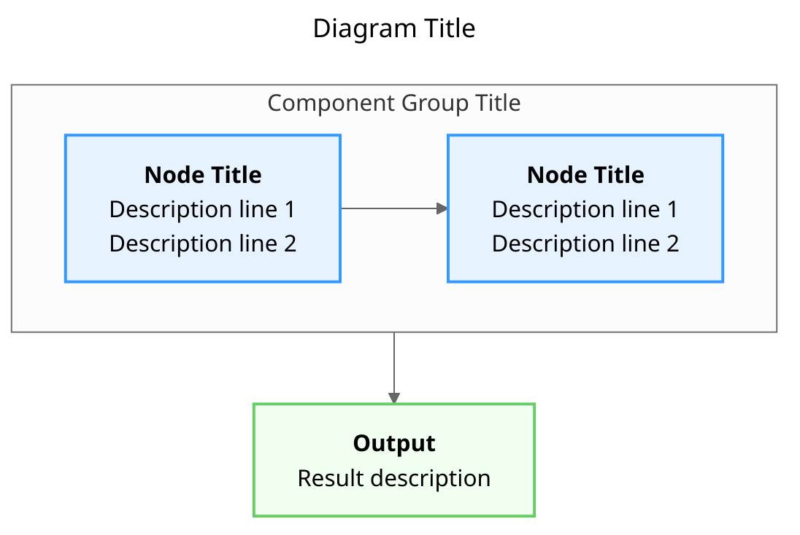

# Diagram Style Guide for POLLN + LOG-Tensor White Papers

## Overview

This style guide provides standards for creating Mermaid.js diagrams for the POLLN + LOG-Tensor white papers. Consistent styling improves readability and professional appearance.

## File Structure

### Diagram Files Location
```
white-papers/diagrams/
├── confidence_cascade_architecture.mmd
├── smpbot_architecture.mmd
├── tile_algebra_composition.mmd
├── geometric_tensor_relationships.mmd
└── system_integration.mmd
```

### Naming Convention
- Use snake_case for filenames
- Descriptive names that indicate content
- Include `.mmd` extension for Mermaid files

## Mermaid Configuration

### Base Configuration
All diagrams should start with this configuration block:

```mermaid
---
title: [Descriptive Title]
config:
  theme: neutral
  fontFamily: "Segoe UI, Tahoma, Geneva, Verdana, sans-serif"
  fontSize: 14
  padding: 20
---
```

### Diagram Types
- Use `flowchart TD` (Top-Down) for most architecture diagrams
- Use `flowchart LR` (Left-Right) for sequential processes
- Use subgraphs to group related components

## Color Scheme

### Confidence Zones
| Zone | Fill Color | Stroke Color | Usage |
|------|------------|--------------|-------|
| RED | `#ffcccc` | `#ff6666` | Confidence 0.00-0.60 |
| YELLOW | `#ffffcc` | `#ffcc00` | Confidence 0.60-0.85 |
| GREEN | `#ccffcc` | `#66cc66` | Confidence 0.85-1.00 |

### Component Types
| Component Type | Fill Color | Stroke Color | Usage |
|----------------|------------|--------------|-------|
| Core Concept | `#e6f3ff` | `#3399ff` | Main system components |
| Process/Operation | `#f0f8ff` | `#66b3ff` | Processing steps |
| Decision Point | `#fff0e6` | `#ff9933` | Conditional logic |
| Data/Output | `#f0fff0` | `#66cc66` | Results, outputs |
| Mechanism | `#fff0f5` | `#ff66b3` | Control mechanisms |
| Application | `#f5f0ff` | `#9966ff` | Use cases, applications |

### Class Definitions
Define CSS classes at the end of the diagram:

```mermaid
classDef redZone fill:#ffcccc,stroke:#ff6666,stroke-width:2px
classDef yellowZone fill:#ffffcc,stroke:#ffcc00,stroke-width:2px
classDef greenZone fill:#ccffcc,stroke:#66cc66,stroke-width:2px
classDef process fill:#e6f3ff,stroke:#3399ff,stroke-width:2px
```

## Layout Guidelines

### Subgraph Organization
- Use subgraphs to group related components
- Label subgraphs clearly with descriptive titles
- Maintain consistent direction (TB for vertical, LR for horizontal)

### Node Content
- Use `<b>bold</b>` for titles within nodes
- Include brief descriptions (2-3 lines max)
- Add examples where helpful
- Use line breaks (`<br/>`) for readability

### Connection Styles
- Use `-->` for normal flow
- Use `-.->` for optional/dashed connections
- Use `==>` for emphasized connections
- Label connections when direction isn't obvious

## Diagram Content Standards

### Title and Description
Each diagram should include:
1. **Title**: Clear, descriptive title
2. **Explanation Section**: Text explanation after the diagram code
3. **Key Insights**: Bullet points highlighting main takeaways

### Example Structure
````markdown
```mermaid
[Diagram code here]
```

**Diagram Explanation:**

[2-3 paragraph explanation]

**Key Insights:**
- Insight 1
- Insight 2
- Insight 3
````

## Specific Diagram Types

### 1. Architecture Diagrams
- Show system components and relationships
- Highlight integration points
- Include data flow directions
- Use color coding for different subsystems

### 2. Process Flow Diagrams
- Show sequential steps
- Include decision points
- Highlight feedback loops
- Show parallel processes clearly

### 3. Relationship Diagrams
- Show hierarchical relationships
- Include composition operations
- Highlight key properties
- Show transformation paths

### 4. Integration Diagrams
- Show system boundaries
- Highlight data exchange
- Include transformation steps
- Show confidence propagation

## Best Practices

### 1. Keep Diagrams Focused
- One main concept per diagram
- Limit to 20-30 nodes maximum
- Use multiple diagrams for complex systems

### 2. Maintain Readability
- Use consistent spacing
- Avoid crossing lines when possible
- Align nodes neatly
- Use subgraphs for organization

### 3. Provide Context
- Include explanatory text
- Reference related diagrams
- Link to white paper sections
- Provide usage examples

### 4. Test Rendering
- Test diagrams in Mermaid Live Editor
- Check color contrast
- Verify text fits in nodes
- Test at different zoom levels

## Example Template

````markdown


**Diagram Explanation:**

[2-3 paragraph explanation of what the diagram shows and why it's important]

**Key Insights:**
- Key insight 1 about the system
- Key insight 2 about relationships
- Key insight 3 about implications
````

## Tools and Resources

### Mermaid Live Editor
- Use for testing: https://mermaid.live/
- Check rendering before committing
- Experiment with layouts

### Color Tools
- Color contrast checker: https://webaim.org/resources/contrastchecker/
- Color palette generators
- Accessibility guidelines

### Documentation
- Mermaid.js documentation: https://mermaid.js.org/
- Flowchart syntax guide
- Styling reference

## Revision History

| Date | Version | Changes |
|------|---------|---------|
| 2026-03-11 | 1.0 | Initial style guide created |
| 2026-03-11 | 1.1 | Added color scheme standards |
| 2026-03-11 | 1.2 | Added diagram type guidelines |

## Maintenance

This style guide should be updated when:
1. New diagram types are needed
2. Color scheme changes
3. Best practices evolve
4. Team feedback indicates improvements needed

All diagram creators should review this guide before creating new diagrams and provide feedback for improvements.