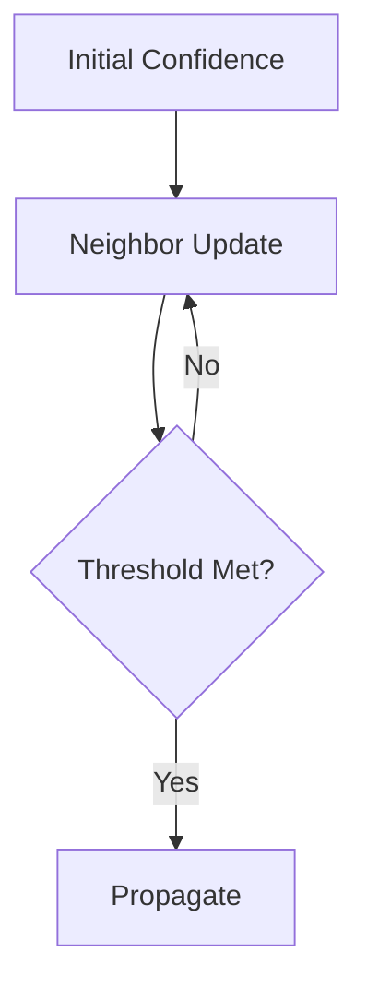
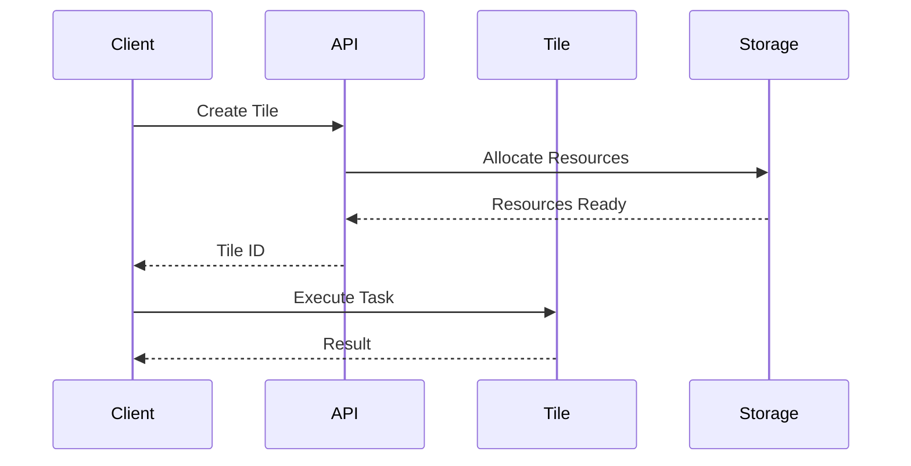

# Contributing to SuperInstance

Thank you for your interest in contributing to SuperInstance! This document provides guidelines and instructions for contributing to the project.

## Table of Contents

- [Code of Conduct](#code-of-conduct)
- [Getting Started](#getting-started)
- [Development Workflow](#development-workflow)
- [Coding Standards](#coding-standards)
- [Testing Guidelines](#testing-guidelines)
- [Documentation Standards](#documentation-standards)
- [Pull Request Process](#pull-request-process)
- [Community Guidelines](#community-guidelines)

## Code of Conduct

### Our Pledge

In the interest of fostering an open and welcoming environment, we as contributors and maintainers pledge to make participation in our project and our community a harassment-free experience for everyone.

### Our Standards

Examples of behavior that contributes to a positive environment:

- Using welcoming and inclusive language
- Being respectful of differing viewpoints and experiences
- Gracefully accepting constructive criticism
- Focusing on what is best for the community
- Showing empathy towards other community members

Examples of unacceptable behavior:

- Harassment, trolling, or discriminatory language
- Personal attacks or insulting comments
- Public or private harassment
- Publishing others' private information without permission
- Unprofessional conduct that creates an uncomfortable environment

### Reporting Issues

If you experience or witness unacceptable behavior, please contact the project maintainers at conduct@superinstance.org. All reports will be reviewed and investigated.

## Getting Started

### Prerequisites

Before contributing, ensure you have:

- **Node.js** >= 18.0.0
- **Python** >= 3.10 (for simulation components)
- **Git** for version control
- **Docker** (optional, for containerized development)

### Initial Setup

1. **Fork the Repository**
   ```bash
   # Fork on GitHub, then clone your fork
   git clone https://github.com/YOUR_USERNAME/SuperInstance-papers.git
   cd SuperInstance-papers
   ```

2. **Install Dependencies**
   ```bash
   # Install Node.js dependencies
   npm install

   # Install Python dependencies (if working on simulations)
   cd research/simulations
   pip install -r requirements.txt
   ```

3. **Set Up Development Environment**
   ```bash
   # Run the automated setup script
   python research/phase9_opensource/tools/setup_dev_env.py
   ```

4. **Configure Git Hooks**
   ```bash
   # Install pre-commit hooks
   npm run install-hooks
   ```

### Development Tools

- **IDE**: VSCode with recommended extensions (`.vscode/extensions.json`)
- **Linting**: ESLint + Prettier for JavaScript/TypeScript
- **Testing**: Jest for unit tests, Python unittest for simulations
- **Documentation**: Markdown with markdownlint

## Development Workflow

### Branch Strategy

- **main**: Production-ready code
- **develop**: Integration branch for features
- **feature/***: Individual feature branches
- **fix/***: Bug fixes
- **doc/***: Documentation updates
- **research/***: Research and experimental code

### Creating a Feature Branch

```bash
# Start from develop
git checkout develop
git pull origin develop

# Create feature branch
git checkout -b feature/your-feature-name
```

### Commit Message Format

Follow conventional commits:

```
type(scope): subject

body (optional)

footer (optional)
```

Types:
- `feat`: New feature
- `fix`: Bug fix
- `docs`: Documentation changes
- `style`: Code style changes (formatting, etc.)
- `refactor`: Code refactoring
- `test`: Adding or updating tests
- `chore`: Build process or auxiliary tool changes

Examples:
```bash
git commit -m "feat(simulations): add hydraulic intelligence model"
git commit -m "fix(api): resolve race condition in tile updates"
git commit -m "docs(paper02): clarify SuperInstance type system"
```

## Coding Standards

### General Principles

1. **Clarity Over Cleverness**: Write code that is easy to understand
2. **DRY**: Don't Repeat Yourself - extract common patterns
3. **KISS**: Keep It Simple, Stupid - avoid over-engineering
4. **YAGNI**: You Aren't Gonna Need It - avoid premature optimization

### Language-Specific Standards

#### TypeScript/JavaScript

- Use TypeScript for all new code
- Follow Airbnb Style Guide with project modifications
- Use functional programming patterns where appropriate
- Prefer `const` over `let`, avoid `var`
- Use arrow functions for callbacks
- Add JSDoc comments for public APIs

Example:
```typescript
/**
 * Computes the confidence cascade for a given tile network
 * @param tiles - Array of tiles to process
 * @param options - Configuration options
 * @returns Computed confidence values
 */
export function computeCascade(
  tiles: Tile[],
  options: CascadeOptions
): Map<TileId, number> {
  // Implementation
}
```

#### Python (Simulations)

- Follow PEP 8 style guide
- Use type hints (Python 3.10+)
- Write docstrings in NumPy style
- Prefer composition over inheritance
- Use dataclasses for data structures

Example:
```python
from dataclasses import dataclass
from typing import List, Dict, Optional

@dataclass
class SimulationConfig:
    """Configuration for SuperInstance simulation.

    Attributes:
        num_tiles: Number of tiles in the network
        max_iterations: Maximum iterations before timeout
        gpu_enabled: Whether to use GPU acceleration
    """
    num_tiles: int
    max_iterations: int = 1000
    gpu_enabled: bool = False

    def validate(self) -> None:
        """Validate configuration parameters."""
        if self.num_tiles <= 0:
            raise ValueError("num_tiles must be positive")
```

### Error Handling

- Use specific error types
- Provide meaningful error messages
- Log errors with context
- Recover gracefully when possible

TypeScript:
```typescript
export class SuperInstanceError extends Error {
  constructor(
    message: string,
    public code: string,
    public context?: Record<string, unknown>
  ) {
    super(message);
    this.name = 'SuperInstanceError';
  }
}
```

Python:
```python
class SuperInstanceError(Exception):
    """Base exception for SuperInstance errors."""
    pass

class TileNotFoundError(SuperInstanceError):
    """Raised when a tile cannot be found."""
    pass
```

### Performance Guidelines

1. **Profile First**: Use profilers before optimizing
2. **Measure Impact**: Benchmark before and after changes
3. **Document Trade-offs**: Explain performance decisions
4. **Consider GPU**: For computationally intensive operations

## Testing Guidelines

### Testing Philosophy

- **Unit Tests**: Test individual functions/classes in isolation
- **Integration Tests**: Test component interactions
- **Simulation Tests**: Validate mathematical models
- **E2E Tests**: Test complete user workflows

### Test Coverage Goals

- **Core Framework**: >90% coverage
- **Simulations**: >80% coverage
- **UI Components**: >70% coverage
- **Documentation**: All examples must be tested

### Writing Tests

#### TypeScript (Jest)

```typescript
describe('computeCascade', () => {
  it('should compute confidence values for simple network', () => {
    const tiles = createTestTiles(5);
    const result = computeCascade(tiles, { iterations: 100 });

    expect(result.size).toBe(5);
    expect(result.get(tiles[0].id)).toBeCloseTo(1.0, 2);
  });

  it('should handle empty network', () => {
    const result = computeCascade([], {});
    expect(result.size).toBe(0);
  });

  it('should throw on invalid configuration', () => {
    expect(() => {
      computeCascade([], { iterations: -1 });
    }).toThrow(SuperInstanceError);
  });
});
```

#### Python (unittest)

```python
import unittest
from superinstance.simulations import hydraulic_intelligence

class TestHydraulicIntelligence(unittest.TestCase):
    def setUp(self):
        """Set up test fixtures."""
        self.config = SimulationConfig(num_tiles=10)

    def test_pressure_differential(self):
        """Test pressure differential computation."""
        result = hydraulic_intelligence.compute_pressure(self.config)
        self.assertGreater(result.max_pressure, 0)
        self.assertLess(result.max_pressure, 100)

    def test_kirchhoff_law(self):
        """Test flow conservation."""
        result = hydraulic_intelligence.compute_flow(self.config)
        self.assertAlmostEqual(result.flow_in, result.flow_out, places=5)

if __name__ == '__main__':
    unittest.main()
```

### Running Tests

```bash
# Run all tests
npm test

# Run TypeScript tests
npm run test:ts

# Run Python simulation tests
cd research/simulations
python -m pytest tests/

# Run with coverage
npm run test:coverage
```

## Documentation Standards

### Types of Documentation

1. **API Documentation**: Generated from code comments
2. **User Guides**: Step-by-step tutorials
3. **Research Papers**: Mathematical foundations and theory
4. **Architecture Docs**: System design and rationale

### Writing Documentation

#### Markdown Style

- Use ATX-style headings (`#`, `##`, etc.)
- Include table of contents for long documents
- Use code blocks with language tags
- Add diagrams where helpful (Mermaid, ASCII art)

Example:
```markdown
# Confidence Cascade Architecture

## Overview

The confidence cascade mechanism propagates certainty through tile networks.

## Algorithm



## Usage

```typescript
const cascade = new ConfidenceCascade(config);
await cascade.propagate();
```
```

#### API Documentation

Use JSDoc/TypeDoc for TypeScript:

```typescript
/**
 * Manages tile lifecycle and state transitions
 *
 * @example
 * ```typescript
 * const manager = new TileManager();
 * const tile = await manager.createTile({
 *   type: 'compute',
 *   config: { cores: 4 }
 * });
 * ```
 */
export class TileManager {
  // Implementation
}
```

#### Research Documentation

When documenting research contributions:
- State the problem clearly
- Explain the mathematical approach
- Provide pseudocode
- Include complexity analysis
- Reference related papers

### Diagram Standards

Use Mermaid for diagrams in markdown:



## Pull Request Process

### Before Submitting

1. **Update Documentation**: Ensure docs reflect your changes
2. **Add Tests**: Include tests for new functionality
3. **Run Linting**: Ensure code passes all linters
4. **Update Changelog**: Add entry to `CHANGELOG.md`
5. **Test Locally**: Verify changes work as expected

### PR Submission

1. **Create Pull Request**
   ```bash
   git push origin feature/your-feature
   # Then create PR on GitHub
   ```

2. **PR Title**: Use conventional commit format
   ```
   feat(simulations): add self-play mechanism with ELO tracking
   ```

3. **PR Description Template**:
   ```markdown
   ## Summary
   Brief description of changes

   ## Changes
   - [ ] New feature
   - [ ] Bug fix
   - [ ] Breaking change
   - [ ] Documentation update

   ## Testing
   - [ ] Unit tests added/updated
   - [ ] Integration tests pass
   - [ ] Manual testing completed

   ## Checklist
   - [ ] Code follows style guidelines
   - [ ] Self-review completed
   - [ ] Documentation updated
   - [ ] No new warnings generated
   - [ ] Tests added/updated
   - [ ] All tests passing
   - [ ] Commits follow conventions
   ```

### Review Process

1. **Automated Checks**: CI runs tests and linters
2. **Code Review**: Maintainers review within 48 hours
3. **Address Feedback**: Make requested changes
4. **Approval**: One maintainer approval required
5. **Merge**: Squash-merge to maintain clean history

### Review Guidelines

For reviewers:
- Be constructive and respectful
- Explain reasoning for suggestions
- Approve if code is good enough, not perfect
- Test locally if needed
- Respond to review comments promptly

## Community Guidelines

### Communication Channels

- **GitHub Issues**: Bug reports and feature requests
- **GitHub Discussions**: General questions and ideas
- **Discord**: Real-time chat (invite in README)
- **Discourse**: Long-form discussions and tutorials

### Asking for Help

When asking questions:
1. Search existing issues and discussions first
2. Provide context and minimal reproducible example
3. Include error messages and stack traces
4. Share your environment details
5. Be patient and respectful

### Reporting Bugs

Use the bug report template:

```markdown
**Description**
Clear description of the bug

**To Reproduce**
Steps to reproduce the behavior

**Expected Behavior**
What you expected to happen

**Environment**
- OS: [e.g. Ubuntu 20.04]
- Node.js: [e.g. 18.0.0]
- SuperInstance: [e.g. v2.1.0]

**Additional Context**
Logs, screenshots, etc.
```

### Suggesting Features

Use the feature request template:

```markdown
**Problem Statement**
What problem does this solve?

**Proposed Solution**
How should it work?

**Alternatives Considered**
What other approaches did you consider?

**Additional Context**
Examples, mockups, references
```

### First-Time Contributors

We welcome first-time contributors! Look for issues labeled:
- `good first issue`: Suitable for newcomers
- `help wanted`: Community contributions welcome
- `documentation`: Documentation improvements

Steps for first-time contributors:
1. Read the contributor guide
2. Join the community Discord for help
3. Find a `good first issue`
4. Comment that you'd like to work on it
5. Ask questions if you get stuck
6. Submit your PR and celebrate!

## Recognition

Contributors are recognized through:
- Contributors section in README
- Release notes attribution
- Annual contributor appreciation post
- Merit-based maintainer invitations
- Academic co-authorship opportunities (for research contributions)

## Additional Resources

- [Project README](../README.md)
- [API Documentation](docs/API_REFERENCE.md)
- [Architecture Guide](docs/ARCHITECTURE.md)
- [Research Papers](docs/PAPERS_GUIDE.md)
- [Troubleshooting](docs/TROUBLESHOOTING.md)

## Questions?

If you have questions about contributing:
- Check existing [GitHub Discussions](https://github.com/SuperInstance/SuperInstance-papers/discussions)
- Join our [Discord community](https://discord.gg/superinstance)
- Open a [GitHub Discussion](https://github.com/SuperInstance/SuperInstance-papers/discussions/new)

---

**Happy Contributing! 🚀**

Every contribution, no matter how small, helps make SuperInstance better. Thank you for your time and effort!
