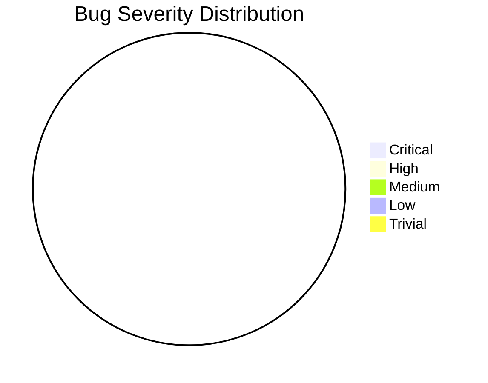
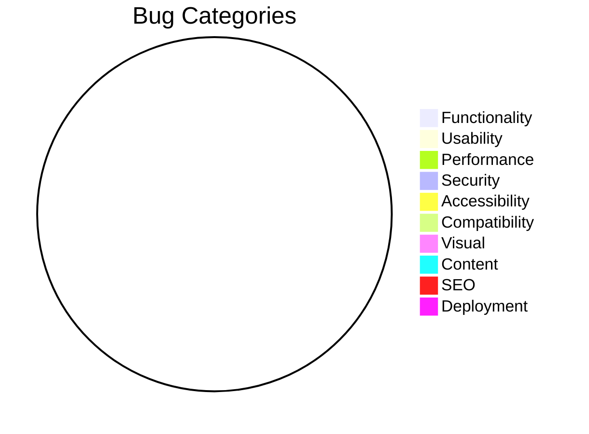
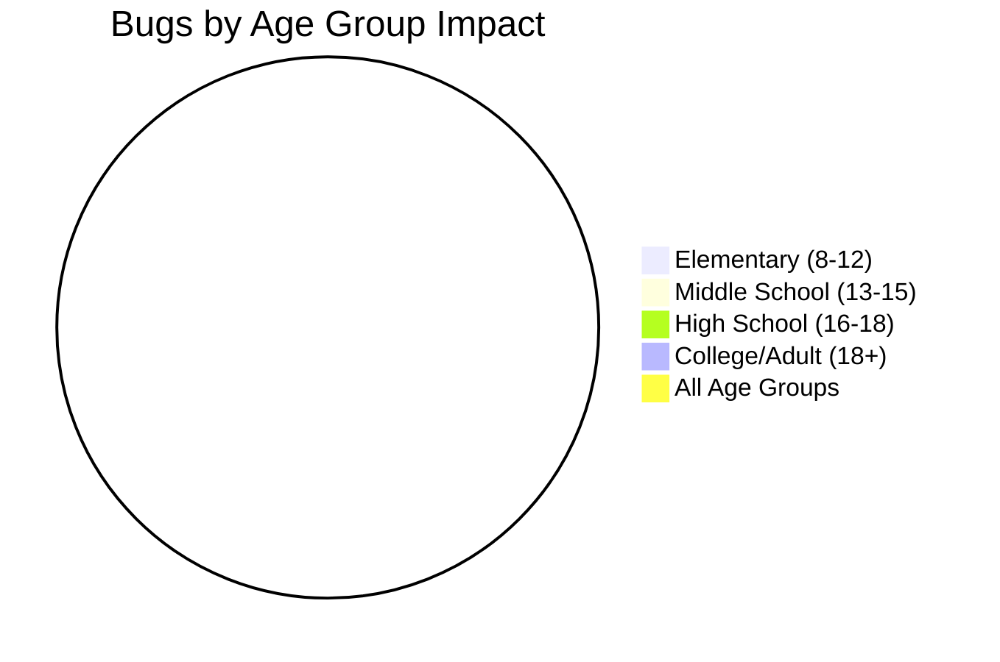

# Bug Tracking Dashboard
**Last Updated:** 2026-03-11
**Dashboard Version:** 1.0

## Overview
This dashboard tracks all bugs and issues for the SuperInstance educational website, with a focus on educational effectiveness and age-appropriate design.

## Key Metrics
| Metric | Current Value | Target | Status |
|--------|---------------|--------|--------|
| **Total Open Bugs** | 0 | < 10 | ✅ |
| **Critical Bugs** | 0 | 0 | ✅ |
| **High Priority Bugs** | 0 | < 3 | ✅ |
| **Mean Time To Resolution** | N/A | < 24h | ⚠️ |
| **Bug Reopen Rate** | 0% | < 5% | ✅ |
| **Test Coverage** | 14 tests | > 80% | ⚠️ |
| **Accessibility Score** | N/A | WCAG 2.1 AA | ⚠️ |
| **Performance Score** | N/A | > 90 | ⚠️ |

## Bug Severity Distribution

## Bug Categories

## Age Group Impact

## Current Issues

### Critical Issues (P0)
| ID | Title | Age Group | Impact | Created | Status |
|----|-------|-----------|--------|---------|--------|
| - | No critical issues | - | - | - | ✅ |

### High Priority Issues (P1)
| ID | Title | Age Group | Impact | Created | Status |
|----|-------|-----------|--------|---------|--------|
| - | No high priority issues | - | - | - | ✅ |

### Medium Priority Issues (P2)
| ID | Title | Age Group | Impact | Created | Status |
|----|-------|-----------|--------|---------|--------|
| 1 | Playwright E2E tests failing | All | Testing | 2026-03-11 | 🔄 In Progress |
| 2 | Missing accessibility tests | All | Compliance | 2026-03-11 | 📋 Planned |
| 3 | Incomplete test coverage | All | Quality | 2026-03-11 | 📋 Planned |

### Low Priority Issues (P3)
| ID | Title | Age Group | Impact | Created | Status |
|----|-------|-----------|--------|---------|--------|
| - | No low priority issues | - | - | - | ✅ |

### Trivial Issues (P4)
| ID | Title | Age Group | Impact | Created | Status |
|----|-------|-----------|--------|---------|--------|
| - | No trivial issues | - | - | - | ✅ |

## Issue Details

### Issue #1: Playwright E2E Tests Failing
- **Severity:** Medium
- **Category:** Deployment
- **Age Group Impact:** All
- **Status:** In Progress
- **Created:** 2026-03-11
- **Last Updated:** 2026-03-11

**Description:**
Playwright E2E tests are failing because the website needs to be running for tests to execute. The tests are configured correctly but require a running server.

**Impact:**
- Blocks CI/CD pipeline from running E2E tests
- Prevents automated testing of user workflows
- Affects testing automation reliability

**Reproduction Steps:**
1. Run `npm run test:e2e` in website directory
2. Observe tests fail with connection errors

**Expected Behavior:**
Tests should run against a local development server or mock environment.

**Actual Behavior:**
Tests fail because no server is running.

**Workaround:**
Manually start development server before running tests.

**Fix Plan:**
1. Update Playwright configuration to start dev server automatically
2. Create mock server for CI environment
3. Implement proper test isolation

### Issue #2: Missing Accessibility Tests
- **Severity:** Medium
- **Category:** Accessibility
- **Age Group Impact:** All (especially users with disabilities)
- **Status:** Planned
- **Created:** 2026-03-11
- **Last Updated:** 2026-03-11

**Description:**
No automated accessibility testing is implemented. WCAG 2.1 AA compliance is required for educational websites.

**Impact:**
- Risk of accessibility violations
- Potential exclusion of users with disabilities
- Legal compliance risk

**Fix Plan:**
1. Implement axe-core for automated accessibility testing
2. Set up pa11y CI for continuous monitoring
3. Create manual testing checklist for screen readers
4. Implement keyboard navigation testing

### Issue #3: Incomplete Test Coverage
- **Severity:** Medium
- **Category:** Quality
- **Age Group Impact:** All
- **Status:** Planned
- **Created:** 2026-03-11
- **Last Updated:** 2026-03-11

**Description:**
Only Button component has unit tests. Other components and utilities are untested.

**Impact:**
- Low confidence in code changes
- Higher risk of regression bugs
- Poor quality metrics

**Current Coverage:**
- Button component: 14 tests ✅
- Other components: 0 tests ❌
- Utilities: 0 tests ❌
- Total coverage: < 10% ❌

**Fix Plan:**
1. Create tests for Card component
2. Create tests for Navigation component
3. Create tests for utility functions
4. Set up coverage thresholds (80% minimum)

## Regression Test Status

### Smoke Tests (Basic Functionality)
| Test | Status | Last Run | Result |
|------|--------|----------|--------|
| Homepage Load | ⚠️ | 2026-03-11 | Needs server |
| Navigation Works | ⚠️ | 2026-03-11 | Needs server |
| Search Works | ⚠️ | 2026-03-11 | Needs server |
| Basic Forms Work | ⚠️ | 2026-03-11 | Not implemented |

### Sanity Tests (Key Features)
| Test | Status | Last Run | Result |
|------|--------|----------|--------|
| User Registration | ⚠️ | - | Not implemented |
| Demo Interaction | ⚠️ | - | Not implemented |
| Documentation Access | ⚠️ | 2026-03-11 | Needs server |
| Feature Pages | ⚠️ | 2026-03-11 | Needs server |

### Comprehensive Tests (Full Regression)
| Test | Status | Last Run | Result |
|------|--------|----------|--------|
| All E2E Tests | ⚠️ | 2026-03-11 | Needs server |
| Performance Benchmarks | ⚠️ | - | Not implemented |
| Security Scans | ✅ | - | Configuration ready |
| Accessibility Checks | ⚠️ | - | Not implemented |

## Educational Effectiveness Metrics

### Learning Pathway Testing
| Pathway | Completion Rate | Avg. Time | Satisfaction |
|---------|----------------|-----------|-------------|
| Elementary Introduction | N/A | N/A | N/A |
| Middle School Concepts | N/A | N/A | N/A |
| High School Advanced | N/A | N/A | N/A |
| College/Professional | N/A | N/A | N/A |

### Age-Appropriate Content Validation
| Age Group | Readability Score | Cognitive Load | Engagement |
|-----------|-------------------|----------------|------------|
| Elementary (8-12) | N/A | N/A | N/A |
| Middle School (13-15) | N/A | N/A | N/A |
| High School (16-18) | N/A | N/A | N/A |
| College/Adult (18+) | N/A | N/A | N/A |

## Performance Metrics

### Core Web Vitals
| Metric | Current | Target | Status |
|--------|---------|--------|--------|
| LCP (Largest Contentful Paint) | N/A | < 2.5s | ⚠️ |
| FID (First Input Delay) | N/A | < 100ms | ⚠️ |
| CLS (Cumulative Layout Shift) | N/A | < 0.1 | ⚠️ |
| FCP (First Contentful Paint) | N/A | < 1.8s | ⚠️ |

### Bundle Size
| Asset Type | Current | Target | Status |
|------------|---------|--------|--------|
| JavaScript (initial) | N/A | < 170KB | ⚠️ |
| JavaScript (total) | N/A | < 500KB | ⚠️ |
| CSS (initial) | N/A | < 50KB | ⚠️ |
| CSS (total) | N/A | < 100KB | ⚠️ |

## Security Status

### Vulnerability Scan
| Severity | Count | Status |
|----------|-------|--------|
| Critical | 0 | ✅ |
| High | 0 | ✅ |
| Medium | 0 | ✅ |
| Low | 0 | ✅ |

### Security Headers
| Header | Present | Correct | Status |
|--------|---------|---------|--------|
| Content-Security-Policy | ✅ | ✅ | ✅ |
| X-Frame-Options | ✅ | ✅ | ✅ |
| X-Content-Type-Options | ✅ | ✅ | ✅ |
| Referrer-Policy | ✅ | ✅ | ✅ |
| Permissions-Policy | ✅ | ✅ | ✅ |
| Strict-Transport-Security | ✅ | ✅ | ✅ |

## Accessibility Compliance

### WCAG 2.1 AA Requirements
| Principle | Status | Issues |
|-----------|--------|--------|
| Perceivable | ⚠️ | Not tested |
| Operable | ⚠️ | Not tested |
| Understandable | ⚠️ | Not tested |
| Robust | ⚠️ | Not tested |

### Screen Reader Testing
| Screen Reader | Status | Issues |
|---------------|--------|--------|
| NVDA | ⚠️ | Not tested |
| VoiceOver | ⚠️ | Not tested |
| JAWS | ⚠️ | Not tested |

## Recent Changes & Impact

### Last Week (2026-03-04 to 2026-03-11)
1. **Test Infrastructure Setup**
   - Added Vitest configuration
   - Added Playwright configuration
   - Created GitHub Actions workflow
   - Impact: Improved testing foundation

2. **Bug Tracking System**
   - Created bug report template
   - Set up bug tracking dashboard
   - Impact: Better issue management

3. **Component Tests**
   - Added Button component tests (14 tests)
   - Impact: Basic test coverage established

### Next Week Focus (2026-03-11 to 2026-03-18)
1. Fix Playwright E2E test configuration
2. Implement accessibility testing
3. Create tests for remaining components
4. Set up performance monitoring

## Risk Assessment

### High Risk Areas
1. **Accessibility Compliance**
   - Risk: Legal non-compliance, exclusion of users
   - Mitigation: Implement automated accessibility testing

2. **Test Coverage**
   - Risk: Regression bugs, low confidence in changes
   - Mitigation: Increase test coverage to 80%

3. **Performance**
   - Risk: Poor user experience, especially on mobile
   - Mitigation: Implement performance monitoring

### Medium Risk Areas
1. **Cross-Browser Compatibility**
   - Risk: Inconsistent experience across browsers
   - Mitigation: Implement cross-browser testing

2. **Educational Effectiveness**
   - Risk: Poor learning outcomes
   - Mitigation: Implement learning analytics

### Low Risk Areas
1. **Security**
   - Current status: Good configuration, no vulnerabilities
   - Monitoring: Regular dependency scanning

## Recommendations

### Immediate Actions (This Week)
1. Fix Playwright configuration to start dev server automatically
2. Implement basic accessibility testing with axe-core
3. Create tests for Card and Navigation components

### Short-term Actions (Next 2 Weeks)
1. Implement performance monitoring with Lighthouse CI
2. Set up cross-browser testing matrix
3. Create educational effectiveness test plans

### Long-term Actions (Next Month)
1. Implement real user monitoring
2. Set up A/B testing framework
3. Create comprehensive security testing

## Dashboard Maintenance
- **Update Frequency:** Daily
- **Last Updated:** 2026-03-11
- **Next Update:** 2026-03-12
- **Maintainer:** QA Team

---

*This dashboard is automatically generated from test results and issue tracking. Manual updates may be required for qualitative assessments.*