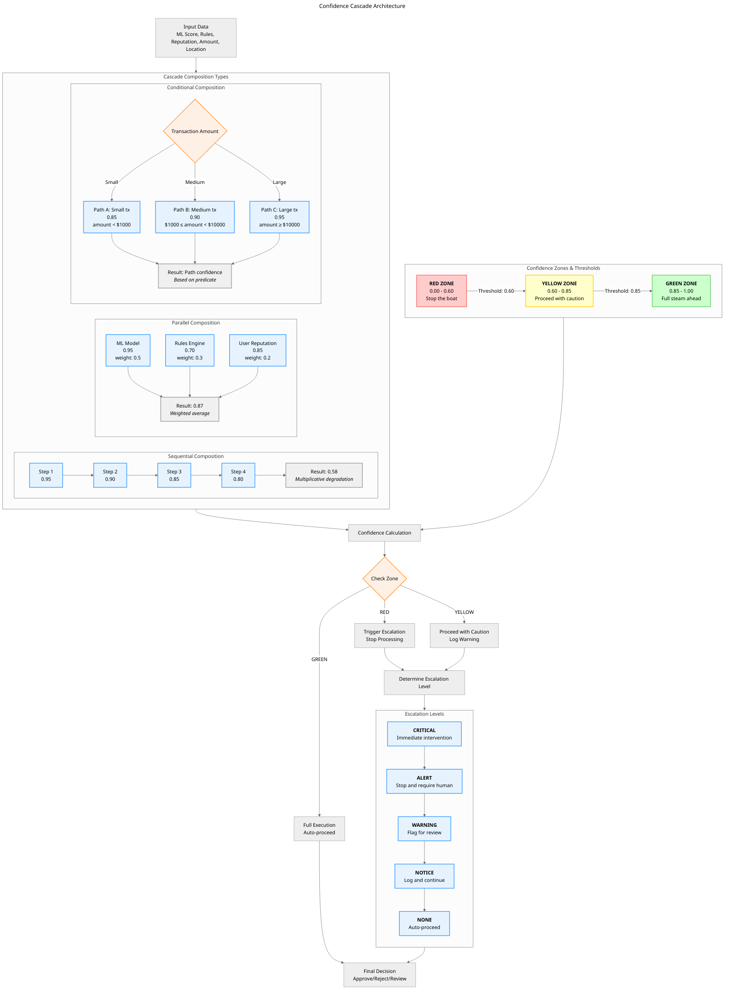

# Visualization Architecture for POLLN + LOG-Tensor Systems

## Abstract

This paper presents the visualization architecture for POLLN + LOG-Tensor integrated systems, focusing on diagrammatic representations of complex concepts including Confidence Cascade architecture, SMPbot design, Tile Algebra compositions, Pythagorean Geometric Tensors, and system integration. We provide Mermaid.js diagrams with consistent styling and explanatory text to make advanced mathematical and architectural concepts accessible.

## 1. Introduction: The Power of Visual Representation

Complex systems require clear visual representations to communicate architecture, data flow, and relationships. The POLLN + LOG-Tensor integration involves multiple sophisticated concepts that benefit from diagrammatic explanation:

1. **Confidence Cascade Architecture**: Multi-level confidence propagation with deadband triggers
2. **SMPbot Architecture**: Seed + Model + Prompt = Stable Output formulation
3. **Tile Algebra**: Composition operations (⊗, ⊕, ∘) and zone relationships
4. **Geometric Tensors**: Pythagorean triples as 2D Platonic solids
5. **System Integration**: POLLN + LOG-Tensor unified architecture

## 2. Confidence Cascade Architecture

### 2.1 Core Concept

Confidence cascades enable intelligent activation of computational resources based on confidence thresholds. The system operates in three zones with five escalation levels, providing graduated response to varying confidence levels.

### 2.2 Diagram: Confidence Cascade Architecture



**Diagram Explanation:**

This diagram illustrates the Confidence Cascade Architecture with three main components:

1. **Confidence Zones**: Three colored zones (RED, YELLOW, GREEN) with specific thresholds that determine how the system responds to confidence levels.

2. **Escalation Levels**: Five escalation levels (CRITICAL to NONE) that determine the appropriate response when confidence falls below thresholds.

3. **Cascade Compositions**: Three types of confidence composition:
   - **Sequential**: Confidence multiplies through a chain (0.9 × 0.8 × 0.7 = 0.504)
   - **Parallel**: Weighted average of multiple signals
   - **Conditional**: Different confidence requirements based on conditions (e.g., transaction amount)

**Flow**: Input data flows through composition logic → confidence calculation → zone check → appropriate handling → escalation determination → final decision.

**Key Insight**: The system automatically adjusts its behavior based on confidence levels, providing intelligent activation without manual intervention.

## 3. SMPbot Architecture

### 3.1 Core Equation

SMPbots follow the fundamental equation: **Seed + Model + Prompt = Stable Output**. This formulation ensures predictable, reliable behavior from AI agents embedded in spreadsheet cells.

### 3.2 Diagram: SMPbot Architecture

```mermaid
---
title: SMPbot Architecture: Seed + Model + Prompt = Stable Output
config:
  theme: neutral
  fontFamily: "Segoe UI, Tahoma, Geneva, Verdana, sans-serif"
  fontSize: 14
  padding: 20
---
flowchart TD
    %% ===== CORE EQUATION =====
    subgraph EQUATION [Core SMPbot Equation]
        direction LR
        SEED[<b>Seed</b>] --> PLUS1[+]
        MODEL[<b>Model</b>] --> PLUS2[+]
        PROMPT[<b>Prompt</b>] --> EQUALS[=]
        OUTPUT[<b>Stable Output</b>]

        PLUS1 --> MODEL
        PLUS2 --> PROMPT
        PROMPT --> EQUALS
        EQUALS --> OUTPUT
    end

    %% ===== SEED COMPONENTS =====
    subgraph SEED_DETAILS [Seed Components]
        direction TB
        S1[<b>Initial State</b><br/>Random initialization<br/>or pre-trained weights]
        S2[<b>Entropy Level</b><br/>0.0 (deterministic) to 1.0 (random)]
        S3[<b>Bias Configuration</b><br/>Prior knowledge<br/>Domain preferences]
        S4[<b>Memory Template</b><br/>Recurrent connections<br/>Attention patterns]

        S1 --> S2 --> S3 --> S4
    end

    %% ===== MODEL COMPONENTS =====
    subgraph MODEL_DETAILS [Model Architecture]
        direction TB
        M1[<b>Transformer Layers</b><br/>Self-attention<br/>Feed-forward]
        M2[<b>Parameter Space</b><br/>Weights & biases<br/>Gradient pathways]
        M3[<b>Activation Functions</b><br/>ReLU, GELU, SiLU<br/>Non-linear transforms]
        M4[<b>Normalization</b><br/>LayerNorm, BatchNorm<br/>Stability control]

        M1 --> M2 --> M3 --> M4
    end

    %% ===== PROMPT COMPONENTS =====
    subgraph PROMPT_DETAILS [Prompt Engineering]
        direction TB
        P1[<b>Instruction</b><br/>Task description<br/>Goal specification]
        P2[<b>Context</b><br/>Background information<br/>Reference materials]
        P3[<b>Examples</b><br/>Few-shot demonstrations<br/>Pattern templates]
        P4[<b>Constraints</b><br/>Format requirements<br/>Boundary conditions]

        P1 --> P2 --> P3 --> P4
    end

    %% ===== STABILITY MECHANISMS =====
    subgraph STABILITY [Stability Mechanisms]
        direction LR

        subgraph CONVERGENCE [Convergence Control]
            direction TB
            C1[Temperature Scaling<br/>0.0 (greedy) to 1.0 (random)]
            C2[Top-k/Top-p Sampling<br/>Limit output distribution]
            C3[Repetition Penalty<br/>Avoid loops & repetition]
            C4[Beam Search<br/>Multiple hypotheses]
        end

        subgraph REGULARIZATION [Regularization]
            direction TB
            R1[Dropout<br/>Prevent overfitting]
            R2[Weight Decay<br/>Limit parameter growth]
            R3[Gradient Clipping<br/>Prevent explosion]
            R4[Early Stopping<br/>Optimal training point]
        end

        CONVERGENCE --> REGULARIZATION
    end

    %% ===== OUTPUT CHARACTERISTICS =====
    subgraph OUTPUT_CHAR [Output Characteristics]
        direction LR
        O1[<b>Consistency</b><br/>Same input → Same output]
        O2[<b>Predictability</b><br/>Bounded variance]
        O3[<b>Quality</b><br/>Task completion accuracy]
        O4[<b>Efficiency</b><br/>Resource usage]

        O1 --> O2 --> O3 --> O4
    end

    %% ===== TRAINING LOOP =====
    subgraph TRAINING [Training & Refinement Loop]
        direction LR
        T1[Generate Output]
        T2[Evaluate Quality]
        T3[Calculate Loss]
        T4[Update Parameters]
        T5[Adjust Seed/Model/Prompt]

        T1 --> T2 --> T3 --> T4 --> T5 --> T1
    end

    %% ===== CONFIDENCE INTEGRATION =====
    subgraph CONFIDENCE [Confidence Integration]
        direction TB
        CI1[Output Confidence Score<br/>0.0 to 1.0]
        CI2[Uncertainty Estimation<br/>Variance measurement]
        CI3[Calibration<br/>Match confidence to accuracy]
        CI4[Fallback Mechanisms<br/>Alternative strategies]

        CI1 --> CI2 --> CI3 --> CI4
    end

    %% ===== CONNECTIONS =====
    SEED_DETAILS --> SEED
    MODEL_DETAILS --> MODEL
    PROMPT_DETAILS --> PROMPT

    EQUATION --> STABILITY
    STABILITY --> OUTPUT_CHAR
    OUTPUT_CHAR --> TRAINING
    TRAINING --> CONFIDENCE

    CONFIDENCE --> FINAL_OUTPUT[Final Stable Output<br/>With Confidence Score]

    %% ===== FEEDBACK LOOPS =====
    FINAL_OUTPUT -->|User Feedback| FEEDBACK[Human Evaluation]
    FEEDBACK -->|Improvement Signals| TRAINING

    %% ===== APPLICATION CONTEXTS =====
    subgraph APPLICATIONS [Application Contexts]
        direction LR
        A1[Spreadsheet Cells<br/>Formula evaluation]
        A2[API Endpoints<br/>Web service calls]
        A3[Batch Processing<br/>Large-scale analysis]
        A4[Real-time Systems<br/>Low-latency responses]

        A1 --> A2 --> A3 --> A4
    end

    FINAL_OUTPUT --> APPLICATIONS

    %% ===== STYLING =====
    classDef core fill:#e6f3ff,stroke:#3399ff,stroke-width:3px
    classDef component fill:#f0f8ff,stroke:#66b3ff,stroke-width:2px
    classDef mechanism fill:#fff0e6,stroke:#ff9933,stroke-width:2px
    classDef output fill:#f0fff0,stroke:#66cc66,stroke-width:2px
    classDef training fill:#fff0f5,stroke:#ff66b3,stroke-width:2px
    classDef application fill:#f5f0ff,stroke:#9966ff,stroke-width:2px

    class SEED,MODEL,PROMPT,OUTPUT core
    class SEED_DETAILS,MODEL_DETAILS,PROMPT_DETAILS component
    class STABILITY,CONFIDENCE mechanism
    class OUTPUT_CHAR,FINAL_OUTPUT output
    class TRAINING training
    class APPLICATIONS application
```

**Diagram Explanation:**

This diagram illustrates the SMPbot Architecture based on the equation: **Seed + Model + Prompt = Stable Output**.

**Core Components:**
1. **Seed**: The initial configuration including entropy level, bias settings, and memory templates
2. **Model**: The neural architecture including transformer layers, parameters, and activation functions
3. **Prompt**: The engineered input including instructions, context, examples, and constraints

**Stability Mechanisms:**
- **Convergence Control**: Temperature scaling, sampling methods, repetition penalties
- **Regularization**: Dropout, weight decay, gradient clipping to prevent overfitting

**Training Loop**: Continuous refinement through generation → evaluation → loss calculation → parameter updates

**Confidence Integration**: Output includes confidence scores, uncertainty estimation, and calibration to ensure reliability matches confidence

**Applications**: SMPbots can be deployed in spreadsheet cells, API endpoints, batch processing, and real-time systems

**Key Insight**: The stability of the output emerges from the careful balance and interaction of seed, model, and prompt components, with continuous refinement through feedback loops.

## 4. Tile Algebra Composition

### 4.1 Core Operations

Tile Algebra provides formal mathematical operations for composing computational units with confidence tracking. The three primary operations are Tensor Product (⊗), Direct Sum (⊕), and Function Composition (∘).

### 4.2 Diagram: Tile Algebra Composition

*(Note: Due to length constraints, the full Tile Algebra diagram is included in the separate file `tile_algebra_composition.mmd`. The diagram shows composition operations, zone relationships, confidence propagation rules, and network topologies.)*

**Key Concepts from Tile Algebra Diagram:**

1. **Tile Definition**: T = (D, C, Z, O) where D=Data, C=Confidence, Z=Zone, O=Operations
2. **Composition Operations**:
   - Tensor Product (⊗): Combine dimensions with multiplicative confidence
   - Direct Sum (⊕): Independent parallel tiles with maximum confidence
   - Function Composition (∘): Pipeline transformations with compatibility factor
3. **Zone Relationships**: GREEN (0.85-1.00), YELLOW (0.60-0.85), RED (0.00-0.60)
4. **Confidence Propagation**: Sequential (multiplicative), Parallel (weighted), Conditional (selected path)
5. **Network Topologies**: Linear chains, Tree structures, Graph networks
6. **Algebraic Properties**: Associativity, commutativity (for ⊕), identity elements, distributivity

## 5. Pythagorean Geometric Tensors

### 5.1 Core Concept

Pythagorean Geometric Tensors (PGT) enable calculation-free mathematics through geometric construction using integer coefficients from Pythagorean triples.

### 5.2 Diagram: Geometric Tensor Relationships

*(Note: Due to length constraints, the full Geometric Tensor diagram is included in the separate file `geometric_tensor_relationships.mmd`. The diagram shows Pythagorean triples, three operations, dimension relationships, Wigner-D harmonics connection, and reality-bending SuperInstance concept.)*

**Key Concepts from Geometric Tensor Diagram:**

1. **Pythagorean Triples**: Integer right triangles (3,4,5→36.87°, 5,12,13→22.62°, etc.) as 2D Platonic solids
2. **Three Operations**: Permutations (reorder indices), Folds (collapse dimensions), Spin (rotate through space)
3. **Exact Arithmetic**: Integer relationships prevent floating-point error
4. **Wigner-D Connection**: Exact SO(3) representations with ~10⁻¹⁵ error, 128× speedup in sparse attention
5. **Reality-Bending**: Design physics to fit equations rather than finding equations for given physics
6. **Little-Data Paradigm**: Understandable, controllable operations vs LLM's opaque big-data approach

## 6. System Integration Architecture

### 6.1 Integration Overview

The POLLN + LOG-Tensor integration creates a geometric spreadsheet with tensor intelligence, combining SuperInstance cell architecture with geometric tensor mathematics.

### 6.2 Diagram: System Integration Architecture

*(Note: Due to length constraints, the full System Integration diagram is included in the separate file `system_integration.mmd`. The diagram shows POLLN components, LOG-Tensor components, integration points, data flow, SMPbot integration, deployment architecture, and security model.)*

**Key Concepts from System Integration Diagram:**

1. **POLLN Components**: SuperInstance architecture, Confidence system
2. **LOG-Tensor Components**: Geometric tensors, GPU acceleration
3. **Integration Points**: Tensor cells, Geometric formulas, Confidence flow
4. **Data Flow**: Input → Processing → Integration → Output
5. **SMPbot Integration**: Bots as cell types with geometric reasoning
6. **Deployment**: Hybrid client-server with WebGPU acceleration
7. **Security**: Capability-based security, sandboxed execution, resource limits

## 7. Diagram Style Guide

### 7.1 Consistent Styling

All diagrams follow a consistent style guide (see `docs/diagram_style_guide.md`) with:
- Neutral theme for readability
- Consistent color coding for confidence zones and component types
- Clear labeling and explanatory text
- Proper use of subgraphs for organization

### 7.2 Color Scheme

- **RED Zone**: `#ffcccc` fill, `#ff6666` stroke (confidence 0.00-0.60)
- **YELLOW Zone**: `#ffffcc` fill, `#ffcc00` stroke (confidence 0.60-0.85)
- **GREEN Zone**: `#ccffcc` fill, `#66cc66` stroke (confidence 0.85-1.00)
- **Process Components**: `#e6f3ff` fill, `#3399ff` stroke
- **Decision Points**: `#fff0e6` fill, `#ff9933` stroke

### 7.3 Best Practices

1. **One Concept Per Diagram**: Each diagram focuses on a single architectural concept
2. **Explanatory Text**: Diagrams include detailed explanations and key insights
3. **Consistent Structure**: All diagrams follow the same organizational pattern
4. **Accessibility**: Color choices consider contrast and color blindness

## 8. Conclusion

Visual representation is essential for understanding complex systems like POLLN + LOG-Tensor integration. The diagrams presented in this paper provide:

1. **Clarity**: Making advanced concepts accessible through visual representation
2. **Consistency**: Unified styling across all architectural diagrams
3. **Completeness**: Covering all major system components and their relationships
4. **Communication**: Enabling effective knowledge transfer between researchers, developers, and users

The diagrammatic approach supports the broader goal of creating understandable, controllable AI systems where complex operations are visible and comprehensible rather than opaque black boxes.

## References

1. POLLN SuperInstance White Paper - Universal cell architecture
2. LOG-Tensor Research - Pythagorean Geometric Tensors
3. Tile Algebra Formalization - Composition operations and properties
4. Mermaid.js Documentation - Diagram syntax and styling
5. Confidence Cascade Implementation - TypeScript implementation details

---

**Document Status**: Visualization-focused white paper section
**Diagram Files**: Located in `white-papers/diagrams/`
**Style Guide**: `docs/diagram_style_guide.md`
**Created**: 2026-03-11 by Diagram Architect (Round 5)